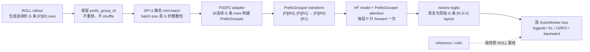

# PrefixGrouper 适配 ROLL：研究与开发准备

> 状态：调研阶段。本文基于 PrefixGrouper `roll-prefixgrouper` 分支，以及 `dependency/ROLL` 中的 ROLL `origin/main` 快照（`78c8c7d`）编写。

## 1、研究分析

### 1.1 目标与边界

本适配的目标是为 ROLL 的 **固定 prompt、多 completion 的 GRPO/RLVR** 训练路径提供 PrefixGrouper 的 shared-prefix forward：每个 prompt 在每层只计算一次，随后让同组 completion 的 suffix attention 复用该 prompt 的 K/V。它与推理侧 prefix caching、以及面向任意前缀树的 PrefixSharing 不同。

本项目当前只实现 ROLL + FSDP2 + PrefixGrouper 的 **DP=1 MVP**：纯文本 causal LM actor、固定 prompt 的 GRPO/RLVR、静态 batch、连续 group。DP>1 的 group-preserving 调度、动态 batching、sequence packing、多模态、LoRA/reference 与 agentic 任意长度轨迹均只作为未来扩展，不在当前开发范围内。

### 1.2 PrefixGrouper 的现有契约

PrefixGrouper 以 `group_info = [[prefix_len, suffix_1_len, ...], ...]` 描述一个 micro-batch。`from_ungrouped_masks()` 可由独立 prompt mask、completion mask 与每个 prompt 的 group size 自动生成该结构。

关键执行链如下：

1. `concat_input(prefix, prefix_mask, suffix, suffix_mask)` 将 `B` 条 prompt 与 `sum(G_i)` 条 completion 压缩为 `B` 条 grouped sequence。
2. 模型 forward 额外接收 `prefix_grouper`。
3. 每层 attention 将 Q/K/V 拆为 prefix 和 suffix：prefix 做一次 attention；suffix Q 对「重复后的 prefix K/V + 自身 suffix K/V」做 attention；再 group 回原输出布局。
4. `split_output(..., include_prefix_last=1)` 还原 completion logits/mask。prefix 最后一个 token 的 logits 用于预测每个 completion 的首 token，因此需复制到每个 suffix 输出的首位。
5. 后续 GRPO loss / backward 使用恢复后的 suffix 输出，语义与未压缩 baseline 一致。

当前实现是 PyTorch autograd 运算：`GroupFunction`/`UngroupFunction` 负责 gather/scatter，attention wrapper 假设 Q/K/V 为 dense `[B, H, S, D]`，并以 Transformers `AttentionInterface` 注册 `prefix_grouper_attention`。其直接可用模型路径是 HuggingFace Transformers；这与 ROLL 的 FSDP2 strategy 是本项目唯一讨论的后端组合。

### 1.3 ROLL 的相关数据和 rollout 语义

ROLL 的 `RLVRConfig.num_return_sequences_in_group` 会写入 actor inference 的 `generating_args.num_return_sequences`。vLLM/SGLang 返回 `n` 个 completion 后，`concatenate_input_and_output()` 把同一 prompt `repeat(n)`，形成常规完整样本：

```text
[P][R1]
[P][R2]
...
[P][RG]
```

这正是 PrefixGrouper 所需的原始信息，但 ROLL 当前未保留一个显式的「prompt -> completion rows」训练接口：`prompt_id`、`group_ids` 等 metadata 在不同路径中含义不同，不能直接作为 PrefixGrouper group contract。适配层需要在 rollout 完成后、任何重排前，以 token-level prompt 边界及 group membership 构造稳定的 group map。

ROLL 的 actor loss 使用完整 `input_ids` 与 `response_mask[:, 1:]` 计算 logprob、KL、ratio、entropy 和 GRPO/PPO loss。因此适配后必须在进入现有 loss 之前把 grouped logits 还原为原有 `[sum(G_i), S, V]`（或等价的 logprob/entropy）语义；不能改变现有算法 worker 的输入契约。

### 1.4 ROLL 的训练入口与候选落点

“候选落点”指一次 PrefixGrouper actor forward 必经、且各自只承担一种职责的代码位置。MVP 必须同时覆盖下列五处；只改 forward 或只改数据处理都不正确。

| 落点 | 当前代码事实 | PrefixGrouper 责任 |
| --- | --- | --- |
| rollout 后数据契约 | `roll/utils/functionals.py:postprocess_generate()` 已把 prompt + completion 规范为 right-padded `input_ids`、`attention_mask`、`prompt_mask`、`response_mask`；同一 prompt 的 `n` 条 completion 此时连续。 | 创建并持久化稳定 group ID、组内序号和期望组大小；这里只产出普通 ROLL batch，不构造 PrefixGrouper。 |
| 训练前调度 | `roll/pipeline/rlvr/rlvr_pipeline.py` 在 actor `train_step` 前调用 `batch_balance()`；即使 `dp_size=1`，它仍可能按 sequence 长度重排。 | MVP 启用时跳过该 actor train 的 `batch_balance()`；DP=1 不需要负载均衡，保留 rollout 的连续 group 顺序。 |
| actor mini-batch 调度 | `roll/pipeline/base_worker.py:ActorWorker.train_step()` 的外层 iterator 使用 `shuffle=True`；内层 FSDP2 再按 `per_device_train_batch_size` 切分。 | MVP 禁用外层 row shuffle，并校验所有 batch size 都是 group size `G` 的整数倍；因而内层连续切分不会拆 group。 |
| FSDP2 前向入口 | `roll/distributed/strategy/fsdp2_strategy.py` 的 `forward_step()`（无梯度 logprob）和 `FSDP2TrainStrategy.train_step()`（带梯度训练）最终均调用 `_fsdp2_forward(input_ids, attention_mask, position_ids, forward_args)`。 | 在此将普通 rows 转为 grouped input、调用带 `prefix_grouper` 的 HF 模型、恢复原 ROLL logits；两条路径必须复用同一个 helper。 |
| 既有 actor loss | `roll/pipeline/rlvr/actor_worker.py:loss_func()` 使用 `op_compute_log_probs()` / `op_compute_entropy()` 消费完整 `input_ids` 与 logits。 | grouped 输出先恢复成原 `[N,S,V]` layout，使 GRPO/KL/ratio/entropy 代码无感知。 |

MVP 不修改模型加载或 `attn_implementation`。仿 verl，在 ROLL adapter 中 monkey-patch Transformers 的现有 attention function：每次调用从 kwargs 取可选的 `prefix_grouper`；没有时原样调用 attention，有时才进入 PrefixGrouper。这样原模型配置和 baseline 路径完全不变。

### 1.5 调度与并行约束

以下是 MVP 正确性前提；违反任何一项，必须在初始化时拒绝配置，或对**整个** mini-batch 回退原始 forward。

1. **范围：** 仅 `fsdp2_train` actor、纯文本 `AutoModelForCausalLM`、`cp_size=1`、无多模态和 LoRA。reference/critic 保持 ROLL 基线；本功能只优化 actor 的 `compute_log_probs` 与 actor training forward。
2. **完整 GRPO group：** 同 group 的有效 prompt token 与 `prompt_mask` 必须完全一致；group 至少有 2 条、每条至少有 1 个 response token。MVP 要求所有 group 的大小固定为 `G=num_return_sequences_in_group`；被过滤样本只能经 `final_response_mask` 置零，不能删除 row。
3. **DP=1 与可整除：** `dp_size=1`；`per_device_train_batch_size=M`、外层 backward batch size、`infer_batch_size` 都必须满足 `% G == 0`。每一个 gradient-accumulation micro-step 独立满足此条件。
4. **连续 group：** rollout 输出后保留连续 group 顺序；actor train 跳过 `batch_balance` 且外层 iterator `shuffle=False`。MVP 不实现 group-aware scheduler。
5. **禁止冲突调度：** `use_dynamic_batching_in_train/infer=False`、`use_sequence_packing=False`。它们的 token-budget / packing 逻辑不认识 group 边界。
6. **模型能力门槛：** 仅接纳验证过的 HF 模型族：模型 forward 必须把 `prefix_grouper` 传到每层 self-attention，支持 Transformers `AttentionInterface`，且使用 2D text `position_ids`。3D M-RoPE、滑窗/特殊 attention、`output_attentions=True` 或自定义不透传 kwargs 的模型均回退。
7. **统一回退：** 一个模型调用内不得混用 grouped 与普通 rows；数据不合格时整批走未修改的 `_fsdp2_forward()`，并记录 fallback 指标。

### 1.6 关键不变量

- 每个 completion 的 token logprob、entropy、KL、policy loss 与 baseline 对齐；
- `include_prefix_last=1` 后，第一个 completion token 的预测来自共享 prefix 的最后一个 hidden state；
- response mask、final response mask、advantages、old/ref/infer logprobs 必须按原 completion row 和 token 位置恢复；
- 组内顺序、group reward/advantage 语义及 DP 样本数统计保持不变；
- PrefixGrouper 关闭或 batch 不符合条件时严格回退到 ROLL 原路径。

## 2、方案设计

### 2.1 核心流程：一次共享前缀的 actor 训练如何运行

本特性只改变 **actor 的 FSDP2 前向**；ROLL 的 rollout、GRPO reward/advantage、reference、critic、PPO loss 和 optimizer 都继续沿用原实现。核心思想是：ROLL 在模型前暂时把同一 prompt 的多条样本合并，PrefixGrouper 在每层 attention 只算一次 prompt，模型后再恢复成 ROLL 原先期待的多条 logits。



对应一组 `G=3` 的数据，前后形态如下：

```text
ROLL 原训练 rows:     [P][R0]   [P][R1]   [P][R2]    # 3 次重复计算 P
模型 grouped 输入:    [P][R0][R1][R2]                  # 1 条 grouped row
attention 内部语义:   P→P 一次；Rj 只看 P + 自己的 Rj
恢复后的 logits:      logits([P][R0]), logits([P][R1]), logits([P][R2])
```

因此 MVP 只有三项关键工作：保留 group ID、禁止会打散连续 group 的重排/shuffle、在 FSDP2 forward 压缩/执行/恢复。既有 loss 像没有改动一样消费恢复后的 logits。

### 2.2 开发清单：需要改动或新增的代码

| 位置 | 文件 | 主要类/函数 | 为什么需要改 |
| --- | --- | --- | --- |
| ROLL | `roll/utils/prefix_grouper.py`（新增） | attention monkey-patch、`build_pg_from_micro_batch()`、`forward_with_prefix_grouper()` | MVP 的唯一 adapter：从连续 rows 构建 PrefixGrouper、生成 position IDs、做 grouped forward、恢复 logits。没有 `prefix_grouper` 时 monkey-patch 必须调用原 attention。 |
| ROLL | `roll/utils/functionals.py` | `postprocess_generate()` | 在现有重复的 `prompt_id` 基础上保存 `prefix_group_id`；后续即使内部 `prompt_id` 被重设/移除，MVP 仍能识别 group。 |
| ROLL | `roll/pipeline/rlvr/rlvr_pipeline.py` | actor train 前的 `batch_balance()` 调用 | 开关启用且 DP=1 时跳过该调用，避免它打乱连续 group。 |
| ROLL | `roll/pipeline/base_worker.py` | `ActorWorker.train_step()` | 开关启用时以 `shuffle=False` 创建外层 iterator，并校验 outer batch size `% G == 0`。 |
| ROLL | `roll/distributed/strategy/fsdp2_strategy.py` | `forward_step()`、`FSDP2TrainStrategy.train_step()` | 两条 actor forward 调同一个 adapter；校验 micro-batch size `% G == 0`，再用其返回的 restored logits 调用原 loss。 |
| ROLL | 配置与示例 | 一个 `use_prefix_grouper: false` 开关 | 可先置于 actor 的现有 `strategy_config`，避免为 MVP 新建 config/model-provider 改动；默认关闭。 |

明确不改：`roll/pipeline/rlvr/actor_worker.py:loss_func()`、reward/advantage 计算、reference/critic worker、optimizer。它们依然接收原 row 顺序的 batch 和 logits。

### 2.3 核心代码：开发同事需要实现的对象和函数

以下子节按代码数据流排列；可作为实现顺序和 code review 顺序。

#### 2.3.1 设计原则与非目标

采用“**ROLL 管数据契约、调度和最小 FSDP2 hook；PrefixGrouper 管 group transform、attention 注册和可测 adapter**”的边界。MVP 不改变 ROLL 的训练算法：模型前压缩同 prompt rows，模型后严格恢复；恢复后 GRPO/RLVR actor loss、optimizer、FSDP2 backward 和 metrics 均不感知 PrefixGrouper。

第一阶段明确选择**恢复完整 logits**，而不是先修改 `op_compute_log_probs()` / `ActorWorker.loss_func()` 让它们直接消费压缩输出。这样会增加一次 `[N,S,V]` 的可微 scatter，可能限制端到端显存收益，但能最大限度保留既有 loss 契约。直接恢复 response logprob/entropy 是后续独立优化，不得与 MVP 混合。

#### 2.3.2 配置、模型加载与 attention fallback

MVP 只增加 `use_prefix_grouper: false` 和可选 `prefix_grouper_attn_func: flash_attention_2`，可先放到 actor 既有 `strategy_config`，不新建 config dataclass，也不改 model loader。

adapter 初始化时 monkey-patch Transformers 当前使用的 attention function，包装逻辑只有三步：从 kwargs 取并移除 `prefix_grouper`；它为 `None` 时原样调用原函数；它存在时用 `AttentionForward` 调 PrefixGrouper。这与 verl 的路线相同，因此无需把模型 `_attn_implementation` 改成新名字，也无需修改 PrefixGrouper 的核心 `register_transformers.py`。

启用时只校验：FSDP2、DP=1、`cp_size=1`、静态 batching、纯文本、无 LoRA，且目标模型能把 kwargs 传至 attention。先用一个普通 batch 证明 monkey-patch 的 baseline logits 不变，再用一个 grouped batch 证明每层收到 `prefix_grouper`。

#### 2.3.3 连续 group 标识与构建

MVP 只新增一个 tensor 字段 `prefix_group_id[N]`：在 `postprocess_generate()` 复制原始 prompt 的 `prompt_id` 时一并写入。RLVR pipeline 后续会重设并移除工作用的 `prompt_id`，但**不得**重设或移除 `prefix_group_id`。不需要 `completion_index`、`group_size`、`eligible` 等字段。

DP=1 且禁用 balance/shuffle 后，每个 group 保持连续，因此 adapter 只需读取 `prefix_group_id` 的连续 runs：

```text
普通 ROLL rows                         grouped 模型输入
g0: [P][R0], [P][R1], [P][R2]   ->    [P][R0][R1][R2]
g1: [Q][S0], [Q][S1], [Q][S2]   ->    [Q][S0][S1][S2]

run = {start_row, end_row, group_id}; run length 必须等于配置 G
```

`build_pg_from_micro_batch()` 依次验证每 run 长度为 G、同 run 的 `prompt_mask/input_ids` 相同、每条 response 非空；之后直接仿 verl 用第一行 prompt、全部 response mask 调 `PrefixGrouper.from_ungrouped_masks()`。失败即报配置/数据错误；MVP 不做复杂 fallback 混排。

#### 2.3.4 DP=1 顺序 guard 与 iterator

名称保留为“调度”，但 MVP 不新建 scheduler、sampler 或 `group_balance()`。只实施三个 guard：

1. 要求 `dp_size == 1`，并跳过 actor train 前的 `batch_balance()`；
2. 外层 PPO iterator 改为 `shuffle=False`；
3. 校验 `infer_batch_size`、`per_device_train_batch_size`、外层 backward batch size 都能被 `G` 整除。

因此 ROLL 的连续 row 切分天然按完整 group 边界切开。未来若支持 DP>1、shuffle 或 dynamic batching，才新增 group-aware balance/sampler；它们不属于 MVP。

#### 2.3.5 FSDP2 grouped forward 与 logits restore

在 `fsdp2_strategy.py` 新增无状态私有 helper：

```python
def _prefix_grouper_forward(self, data: DataProto) -> torch.Tensor:
    """返回与 data.batch['input_ids'] 对齐的原 ROLL logits layout。"""
```

`forward_step()` 与 `FSDP2TrainStrategy.train_step()` 必须在各自现有的 autocast/no-sync 上下文中调用它；helper 不创建 `no_grad`、autocast、FSDP context，也不调用 backward。流程固定为：

1. 未启用时调用原 `_fsdp2_forward()`；启用时连续 run 校验失败直接报错（MVP 不做混排 fallback）。
2. 构造 grouped `input_ids` / `attention_mask`。一组实际 layout 为 `[P][R0][R1]...`，长度为 `len(P)+Σlen(Rj)`，必须先校验不超过 model max position length。
3. 重新生成 2D grouped `position_ids`：prefix 为 `0..len(P)-1`；每段 suffix 都从 `len(P)` 重新编号。不得对 grouped attention mask 直接 `cumsum`，否则第二个 suffix 的 RoPE position 错接在第一个 suffix 之后。
4. 复制 `forward_args`（禁止原地污染 batch），强制 `use_cache=False`，加入 `prefix_grouper` 与 `prefix_grouper_attn_func`，调用 `self.model(...).logits`。每层必须收到同一 `PrefixGrouper` 实例。
5. 调 `split_output(grouped_logits, include_prefix_last=1)`。对 completion `j` 保留 `suffix_logits[j, :response_len_j]`：第 0 个即 prefix 最后 token 对首个 response token 的预测；末尾额外的 next-token/padding logit 丢弃。
6. 分配零填充 `restored_logits[N,S,V]`，按连续 run 将结果 scatter 至原 row 的 `[prompt_len-1 : prompt_len+response_len-1]`。这正是 ROLL 对 `input_ids[:,1:]` shift 后、`response_mask[:,1:]` 会消费的 logit 位置。
7. 返回 restored logits。它的 batch 顺序与 `[N,S]` shape 必须和原 `input_ids` 完全一致，故 `op_compute_log_probs()`、`op_compute_entropy()` 与 `ActorWorker.loss_func()` 不修改。

该 helper 的调用骨架应保持下面的结构，尤其是 fallback 必须调用原 `_fsdp2_forward()`：

```python
def _prefix_grouper_forward(self, data: DataProto) -> Tensor:
    pg_batch = build_pg_from_micro_batch(data, group_size=G)  # 连续 run → PrefixGrouper + grouped inputs
    logits = self.model(
        **pg_batch.model_inputs,
        use_cache=False,
        prefix_grouper=pg_batch.grouper,
    ).logits
    return restore_logits(pg_batch, logits, data.batch["input_ids"])
```

`forward_step()` 的无梯度 logprob 路径和 `FSDP2TrainStrategy.train_step()` 的有梯度路径都调用此 helper；二者不能各自实现 transform/restore，否则极易发生 old-logprob 和训练 logprob 的对齐差异。

attention 算法仍在 PrefixGrouper：registered attention 对 prefix 只执行一次，对每个 suffix 以“共享 prefix K/V + 自身 suffix K/V”计算。ROLL 只负责把 per-mini-batch 实例送至 model kwargs，绝不复制该算法。

### 2.4 运行约束、回退与观测性

restore scatter 必须保持 PyTorch autograd 图，不能 `.detach()`、转 CPU 或使用丢失梯度的写入方式。验收时 suffix loss 对共享 prefix 的梯度必须等于 baseline 中 G 次独立 prefix forward 梯度之和。

`pg_batch` 仅为本次 forward 的局部变量，不能挂在 strategy 实例上。允许记录无张量 metrics：group 数、group size、原始/压缩有效 token 数、transform/restore 耗时。

配置或连续 run 不兼容时 fail fast，并打印 group ID 与长度；功能关闭时严格走完全未修改的原路径。

### 2.5 实施顺序与验收前置条件

1. **ROLL adapter。** 新增单文件 `roll/utils/prefix_grouper.py`，先完成 monkey-patch、连续 run 构建、position IDs 与 logits restore 的单测。
2. **ROLL 最小 hook。** 保留 `prefix_group_id`，DP=1 时跳过 `batch_balance`，关闭 actor shuffle，并在 FSDP2 两条 forward 路径调用 adapter。
3. **集成验收。** 固定模型与 rollout fixture 下完成 on/off 等价、FSDP2 backward 和性能报告。DP>1 不在本轮验收。

#### 2.5.1 开发前必须完成的三个小实验

在开始 ROLL 的大范围改动前，先完成并记录以下实验；任一失败都应先修模型 adapter，而不是继续调度开发：

1. **attention fallback：** custom attention implementation 下，`prefix_grouper=None` 的 logits 与原 `flash_attention_2` logits 对齐。
2. **参数透传：** selected HF text model 的 `model(..., prefix_grouper=grouper)` 确实让每层 self-attention 收到同一对象；以计数 hook 证明，不能只看无异常。
3. **单 batch 等价：** 不接 ROLL，直接用两组 `[P][R]` 合成 token batch，比对 baseline 与 transform → model → restore 的 response logprob、loss 和 parameter gradient。

三个实验通过后，才将 adapter 接进 ROLL 的最小 metadata、DP=1 guard 和 FSDP2 hook。这样能把“模型 attention 不兼容”和“ROLL 数据顺序错误”分离，显著降低排障成本。

## 3、测试验证

### 3.1 单元测试（CPU）

- group map：固定 group size、混合 prompt、无有效 group，以及可变 group size 必须被拒绝/回退；
- batch transform：input_ids、attention mask、position ids、response/final_response mask、advantages、old/ref/infer logprobs 的 gather/scatter；
- prefix-last 边界：completion 第一个 token 与不同 response 长度；
- fallback：不满足条件时 byte-for-byte 保持 baseline batch；
- DP=1 guard：拒绝 `dp_size != 1`、shuffle、非 G 整除的 batch size 和被打散的连续 run。

### 3.2 数值等价测试（GPU）

对同一固定 rollout 比较 PrefixGrouper off/on：

- forward logits、token logprob、entropy；
- KL、ratio、actor loss；
- 参数梯度、grad norm、optimizer step 后参数；
- group size 2/4/8，短/长 prompt，变长 completion；
- BF16/FP32 容忍度需逐项记录。

### 3.3 集成测试

1. 单卡 FSDP2 文本 GRPO smoke test；
2. DP>1、动态 batching、shuffle 三类配置必须被明确拒绝；
3. PrefixGrouper 关闭、无共享、配置不兼容三种回退；
4. FSDP2 自动混精及不同 group size 的兼容性测试。

### 3.4 性能验证

报告固定模型、prompt 长度、completion 长度、group size、GPU、dtype 和并行度下的：

- actor forward/backward 时间；
- end-to-end train step 时间；
- peak allocated/reserved memory；
- group transform 与 restore 开销；
- 有效 prefix token ratio 与理论/实测加速比。

## 4、开发计划

### Phase 0：协议与基线

- [ ] 固定 ROLL 与 PrefixGrouper 版本；
- [ ] 选定一个文本 GRPO 示例和固定 rollout fixture；
- [ ] 记录 baseline logits/loss/gradient/perf；
- [ ] 定义 ROLL group metadata 和 eligibility 规则。

### Phase 1：数据适配与测试

- [ ] 实现 group map 与完整 batch transform/restore；
- [ ] 添加 CPU 单测和不变量检查；
- [ ] 保留 `prefix_group_id`，并实现 DP=1 / no-shuffle guard；
- [ ] 完成 ROLL 最小 hook PR。

### Phase 2：FSDP2 PoC

- [ ] 增加 Transformers attention registration/透传；
- [ ] 打通单卡文本 GRPO actor forward/backward；
- [ ] 完成 on/off 数值等价和显存/吞吐测量；
- [ ] 加入兼容性 gate 与 baseline fallback。

### Phase 3：上游化

- [ ] ROLL 可选集成 PR；
- [ ] 补齐 FSDP2 的安装、配置与回退说明；
- [ ] 固化兼容性矩阵和复现实验脚本。

## 5、当前结论

1. ROLL 已有 GRPO group rollout 所需的基础数据，但训练前会复制完整 prompt，未实现 PrefixGrouper。
2. PrefixGrouper 的核心数据/attention/output 恢复语义可复用，且其 Transformers B/H/S/D attention adapter 与 ROLL FSDP2/HF 模型组合存在直接的复用路径。
3. 最低风险的实现顺序是：先完成 ROLL 数据契约，再完成 FSDP2/HF 文本 PoC 与数值等价验证。
4. 适配必须把完整 group 作为 DP/micro-batch 调度原子，否则共享前缀不会命中。
5. 对 ROLL 的长期贡献应是可选、可回退的 group-aware hook；PrefixGrouper 算法实现应保持在本仓库。

## 6、遗留问题

- ROLL rollout batch 中何处最可靠地保留 prompt/completion 边界及稳定 group relation？现有 `prompt_id`/`group_ids` 是否足以覆盖同步、异步和 agentic path？
- FSDP2 所用 Transformers 版本和模型 wrapper 是否能无侵入地透传 `prefix_grouper`，或需 ROLL 添加 model-forward hook？
- group-aware DP 负载均衡如何同时保证组完整性和长序列负载均衡？
- PrefixGrouper 为 MIT、ROLL 为 Apache-2.0；两者通常可兼容，但上游集成时需保留 MIT notice，并确认是否采用可选依赖而非复制源码。
