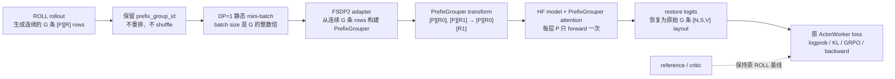

# PrefixGrouper 适配 ROLL：研究与开发准备

> 状态：**Phase 1.2 已闭环（P1.2-G PASSED：组件语义、forward 数值与反向图健康）。** 已严格验证 completion 隔离、K/V、R2[0] restore、FA2-only、FSDP2 hook、forward logits/logprobs/loss 与 operation trace。半精度 FA2 的逐参数 gradient peer 离散保留为历史诊断，不再作为组件验收上界；**最终 RL 训练精度仍必须由 Phase 3 的真实 actor off/on 对照裁决。** 现在进入 Phase 2。

## 1、研究分析

### 1.1 目标与边界

本适配的目标是为 ROLL 的 **固定 prompt、多 completion 的 GRPO/RLVR** 训练路径提供 PrefixGrouper 的 shared-prefix forward：每个 prompt 在每层只计算一次，随后让同组 completion 的 suffix attention 复用该 prompt 的 K/V。它与推理侧 prefix caching、以及面向任意前缀树的 PrefixSharing 不同。

本项目当前只实现 ROLL + FSDP2 + PrefixGrouper 的 **DP=1 MVP**：纯文本 causal LM actor、固定 prompt 的 GRPO/RLVR、静态 batch、连续 group。DP>1 的 group-preserving 调度、动态 batching、sequence packing、多模态、LoRA/reference 与 agentic 任意长度轨迹均只作为未来扩展，不在当前开发范围内。

### 1.2 PrefixGrouper 的现有契约

PrefixGrouper 以 `group_info = [[prefix_len, suffix_1_len, ...], ...]` 描述一个 micro-batch。`from_ungrouped_masks()` 可由独立 prompt mask、completion mask 与每个 prompt 的 group size 自动生成该结构。

关键执行链如下：

1. `concat_input(prefix, prefix_mask, suffix, suffix_mask)` 将 `B` 条 prompt 与 `sum(G_i)` 条 completion 压缩为 `B` 条 grouped sequence。
2. 模型 forward 额外接收 `prefix_grouper`。
3. 每层 attention 将 Q/K/V 拆为 prefix 和 suffix：prefix 做一次 attention；suffix Q 对「重复后的 prefix K/V + 自身 suffix K/V」做 attention；再 group 回原输出布局。
4. `split_output(..., include_prefix_last=1)` 还原 completion logits/mask。prefix 最后一个 token 的 logits 用于预测每个 completion 的首 token，因此需复制到每个 suffix 输出的首位。
5. 后续 GRPO loss / backward 使用恢复后的 suffix 输出，语义与未压缩 baseline 一致。

当前实现是 PyTorch autograd 运算：`GroupFunction`/`UngroupFunction` 负责 gather/scatter，attention wrapper 假设 Q/K/V 为 dense `[B, H, S, D]`，并以 Transformers `AttentionInterface` 注册 `prefix_grouper_attention`。其直接可用模型路径是 HuggingFace Transformers；这与 ROLL 的 FSDP2 strategy 是本项目唯一讨论的后端组合。

### 1.3 ROLL 的相关数据和 rollout 语义

ROLL 的 `RLVRConfig.num_return_sequences_in_group` 会写入 actor inference 的 `generating_args.num_return_sequences`。vLLM/SGLang 返回 `n` 个 completion 后，`concatenate_input_and_output()` 把同一 prompt `repeat(n)`，形成常规完整样本：

```text
[P][R1]
[P][R2]
...
[P][RG]
```

这正是 PrefixGrouper 所需的原始信息，但 ROLL 当前未保留一个显式的「prompt -> completion rows」训练接口：`prompt_id`、`group_ids` 等 metadata 在不同路径中含义不同，不能直接作为 PrefixGrouper group contract。适配层需要在 rollout 完成后、任何重排前，以 token-level prompt 边界及 group membership 构造稳定的 group map。

ROLL 的 actor loss 使用完整 `input_ids` 与 `response_mask[:, 1:]` 计算 logprob、KL、ratio、entropy 和 GRPO/PPO loss。因此适配后必须在进入现有 loss 之前把 grouped logits 还原为原有 `[sum(G_i), S, V]`（或等价的 logprob/entropy）语义；不能改变现有算法 worker 的输入契约。

### 1.4 ROLL 的训练入口与候选落点

“候选落点”指一次 PrefixGrouper actor forward 必经、且各自只承担一种职责的代码位置。MVP 必须同时覆盖下列五处；只改 forward 或只改数据处理都不正确。

| 落点 | 当前代码事实 | PrefixGrouper 责任 |
| --- | --- | --- |
| rollout 后数据契约 | `roll/utils/functionals.py:postprocess_generate()` 已把 prompt + completion 规范为 right-padded `input_ids`、`attention_mask`、`prompt_mask`、`response_mask`；同一 prompt 的 `n` 条 completion 此时连续。 | 创建并持久化稳定 group ID、组内序号和期望组大小；这里只产出普通 ROLL batch，不构造 PrefixGrouper。 |
| 训练前调度 | `roll/pipeline/rlvr/rlvr_pipeline.py` 在 actor `train_step` 前调用 `batch_balance()`；即使 `dp_size=1`，它仍可能按 sequence 长度重排。 | MVP 启用时跳过该 actor train 的 `batch_balance()`；DP=1 不需要负载均衡，保留 rollout 的连续 group 顺序。 |
| actor mini-batch 调度 | `roll/pipeline/base_worker.py:ActorWorker.train_step()` 的外层 iterator 使用 `shuffle=True`；内层 FSDP2 再按 `per_device_train_batch_size` 切分。 | MVP 禁用外层 row shuffle，并校验所有 batch size 都是 group size `G` 的整数倍；因而内层连续切分不会拆 group。 |
| FSDP2 前向入口 | `roll/distributed/strategy/fsdp2_strategy.py` 的 `forward_step()`（无梯度 logprob）和 `FSDP2TrainStrategy.train_step()`（带梯度训练）最终均调用 `_fsdp2_forward(input_ids, attention_mask, position_ids, forward_args)`。 | 在此将普通 rows 转为 grouped input、调用带 `prefix_grouper` 的 HF 模型、恢复原 ROLL logits；两条路径必须复用同一个 helper。 |
| 既有 actor loss | `roll/pipeline/rlvr/actor_worker.py:loss_func()` 使用 `op_compute_log_probs()` / `op_compute_entropy()` 消费完整 `input_ids` 与 logits。 | grouped 输出先恢复成原 `[N,S,V]` layout，使 GRPO/KL/ratio/entropy 代码无感知。 |

MVP 不修改模型加载或 `attn_implementation`。仿 verl，在 ROLL adapter 中 monkey-patch Transformers 的现有 attention function：每次调用从 kwargs 取可选的 `prefix_grouper`；没有时原样调用 attention，有时才进入 PrefixGrouper。这样原模型配置和 baseline 路径完全不变。

### 1.5 调度与并行约束

以下是 MVP 正确性前提；违反任何一项，必须在初始化时拒绝配置，或对**整个** mini-batch 回退原始 forward。

1. **范围：** 仅 `fsdp2_train` actor、纯文本 `AutoModelForCausalLM`、`cp_size=1`、无多模态和 LoRA。reference/critic 保持 ROLL 基线；本功能只优化 actor 的 `compute_log_probs` 与 actor training forward。
2. **完整 GRPO group：** 同 group 的有效 prompt token 与 `prompt_mask` 必须完全一致；group 至少有 2 条、每条至少有 1 个 response token。MVP 要求所有 group 的大小固定为 `G=num_return_sequences_in_group`；被过滤样本只能经 `final_response_mask` 置零，不能删除 row。
3. **DP=1 与可整除：** `dp_size=1`；`per_device_train_batch_size=M`、外层 backward batch size、`infer_batch_size` 都必须满足 `% G == 0`。每一个 gradient-accumulation micro-step 独立满足此条件。
4. **连续 group：** rollout 输出后保留连续 group 顺序；actor train 跳过 `batch_balance` 且外层 iterator `shuffle=False`。MVP 不实现 group-aware scheduler。
5. **禁止冲突调度：** `use_dynamic_batching_in_train/infer=False`、`use_sequence_packing=False`。它们的 token-budget / packing 逻辑不认识 group 边界。
6. **模型能力门槛：** 仅接纳验证过的 HF 模型族：模型 forward 必须把 `prefix_grouper` 传到每层 self-attention，支持 Transformers `AttentionInterface`，且使用 2D text `position_ids`。3D M-RoPE、滑窗/特殊 attention、`output_attentions=True` 或自定义不透传 kwargs 的模型均回退。
7. **统一回退：** 一个模型调用内不得混用 grouped 与普通 rows；数据不合格时整批走未修改的 `_fsdp2_forward()`，并记录 fallback 指标。

### 1.6 关键不变量

- 每个 completion 的 token logprob、entropy、KL、policy loss 与 baseline 对齐；
- `include_prefix_last=1` 后，第一个 completion token 的预测来自共享 prefix 的最后一个 hidden state；
- response mask、final response mask、advantages、old/ref/infer logprobs 必须按原 completion row 和 token 位置恢复；
- 组内顺序、group reward/advantage 语义及 DP 样本数统计保持不变；
- PrefixGrouper 关闭或 batch 不符合条件时严格回退到 ROLL 原路径。

## 2、方案设计

### 2.1 核心流程：一次共享前缀的 actor 训练如何运行

本特性只改变 **actor 的 FSDP2 前向**；ROLL 的 rollout、GRPO reward/advantage、reference、critic、PPO loss 和 optimizer 都继续沿用原实现。核心思想是：ROLL 在模型前暂时把同一 prompt 的多条样本合并，PrefixGrouper 在每层 attention 只算一次 prompt，模型后再恢复成 ROLL 原先期待的多条 logits。



对应一组 `G=3` 的数据，前后形态如下：

```text
ROLL 原训练 rows:     [P][R0]   [P][R1]   [P][R2]    # 3 次重复计算 P
模型 grouped 输入:    [P][R0][R1][R2]                  # 1 条 grouped row
attention 内部语义:   P→P 一次；Rj 只看 P + 自己的 Rj
恢复后的 logits:      logits([P][R0]), logits([P][R1]), logits([P][R2])
```

因此 MVP 只有三项关键工作：保留 group ID、禁止会打散连续 group 的重排/shuffle、在 FSDP2 forward 压缩/执行/恢复。既有 loss 像没有改动一样消费恢复后的 logits。

### 2.2 开发清单：需要改动或新增的代码

| 位置 | 文件 | 主要类/函数 | 为什么需要改 |
| --- | --- | --- | --- |
| ROLL | `roll/utils/prefix_grouper.py`（新增） | attention monkey-patch、`build_pg_from_micro_batch()`、`forward_with_prefix_grouper()` | MVP 的唯一 adapter：从连续 rows 构建 PrefixGrouper、生成 position IDs、做 grouped forward、恢复 logits。没有 `prefix_grouper` 时 monkey-patch 必须调用原 attention。 |
| ROLL | `roll/utils/functionals.py` | `postprocess_generate()` | 在现有重复的 `prompt_id` 基础上保存 `prefix_group_id`；后续即使内部 `prompt_id` 被重设/移除，MVP 仍能识别 group。 |
| ROLL | `roll/pipeline/rlvr/rlvr_pipeline.py` | actor train 前的 `batch_balance()` 调用 | 开关启用且 DP=1 时跳过该调用，避免它打乱连续 group。 |
| ROLL | `roll/pipeline/base_worker.py` | `ActorWorker.train_step()` | 开关启用时以 `shuffle=False` 创建外层 iterator，并校验 outer batch size `% G == 0`。 |
| ROLL | `roll/distributed/strategy/fsdp2_strategy.py` | `forward_step()`、`FSDP2TrainStrategy.train_step()` | 两条 actor forward 调同一个 adapter；校验 micro-batch size `% G == 0`，再用其返回的 restored logits 调用原 loss。 |
| ROLL | 配置与示例 | 一个 `use_prefix_grouper: false` 开关 | 可先置于 actor 的现有 `strategy_config`，避免为 MVP 新建 config/model-provider 改动；默认关闭。 |

明确不改：`roll/pipeline/rlvr/actor_worker.py:loss_func()`、reward/advantage 计算、reference/critic worker、optimizer。它们依然接收原 row 顺序的 batch 和 logits。

### 2.3 核心代码：开发同事需要实现的对象和函数

以下子节按代码数据流排列；可作为实现顺序和 code review 顺序。

#### 2.3.1 设计原则与非目标

采用“**ROLL 管数据契约、调度和最小 FSDP2 hook；PrefixGrouper 管 group transform、attention 注册和可测 adapter**”的边界。MVP 不改变 ROLL 的训练算法：模型前压缩同 prompt rows，模型后严格恢复；恢复后 GRPO/RLVR actor loss、optimizer、FSDP2 backward 和 metrics 均不感知 PrefixGrouper。

第一阶段明确选择**恢复完整 logits**，而不是先修改 `op_compute_log_probs()` / `ActorWorker.loss_func()` 让它们直接消费压缩输出。这样会增加一次 `[N,S,V]` 的可微 scatter，可能限制端到端显存收益，但能最大限度保留既有 loss 契约。直接恢复 response logprob/entropy 是后续独立优化，不得与 MVP 混合。

#### 2.3.2 配置、模型加载与 attention fallback

MVP 只增加 `use_prefix_grouper: false` 和可选 `prefix_grouper_attn_func: flash_attention_2`，可先放到 actor 既有 `strategy_config`，不新建 config dataclass，也不改 model loader。

adapter 初始化时 monkey-patch Transformers 当前使用的 attention function，包装逻辑只有三步：从 kwargs 取并移除 `prefix_grouper`；它为 `None` 时原样调用原函数；它存在时用 `AttentionForward` 调 PrefixGrouper。这与 verl 的路线相同，因此无需把模型 `_attn_implementation` 改成新名字，也无需修改 PrefixGrouper 的核心 `register_transformers.py`。

启用时只校验：FSDP2、DP=1、`cp_size=1`、静态 batching、纯文本、无 LoRA，且目标模型能把 kwargs 传至 attention。先用一个普通 batch 证明 monkey-patch 的 baseline logits 不变，再用一个 grouped batch 证明每层收到 `prefix_grouper`。

#### 2.3.3 连续 group 标识与构建

MVP 只新增一个 tensor 字段 `prefix_group_id[N]`：在 `postprocess_generate()` 复制原始 prompt 的 `prompt_id` 时一并写入。RLVR pipeline 后续会重设并移除工作用的 `prompt_id`，但**不得**重设或移除 `prefix_group_id`。不需要 `completion_index`、`group_size`、`eligible` 等字段。

DP=1 且禁用 balance/shuffle 后，每个 group 保持连续，因此 adapter 只需读取 `prefix_group_id` 的连续 runs：

```text
普通 ROLL rows                         grouped 模型输入
g0: [P][R0], [P][R1], [P][R2]   ->    [P][R0][R1][R2]
g1: [Q][S0], [Q][S1], [Q][S2]   ->    [Q][S0][S1][S2]

run = {start_row, end_row, group_id}; run length 必须等于配置 G
```

`build_pg_from_micro_batch()` 依次验证每 run 长度为 G、同 run 的 `prompt_mask/input_ids` 相同、每条 response 非空；之后直接仿 verl 用第一行 prompt、全部 response mask 调 `PrefixGrouper.from_ungrouped_masks()`。失败即报配置/数据错误；MVP 不做复杂 fallback 混排。

#### 2.3.4 DP=1 顺序 guard 与 iterator

名称保留为“调度”，但 MVP 不新建 scheduler、sampler 或 `group_balance()`。只实施三个 guard：

1. 要求 `dp_size == 1`，并跳过 actor train 前的 `batch_balance()`；
2. 外层 PPO iterator 改为 `shuffle=False`；
3. 校验 `infer_batch_size`、`per_device_train_batch_size`、外层 backward batch size 都能被 `G` 整除。

因此 ROLL 的连续 row 切分天然按完整 group 边界切开。未来若支持 DP>1、shuffle 或 dynamic batching，才新增 group-aware balance/sampler；它们不属于 MVP。

#### 2.3.5 FSDP2 grouped forward 与 logits restore

在 `fsdp2_strategy.py` 新增无状态私有 helper：

```python
def _prefix_grouper_forward(self, data: DataProto) -> torch.Tensor:
    """返回与 data.batch['input_ids'] 对齐的原 ROLL logits layout。"""
```

`forward_step()` 与 `FSDP2TrainStrategy.train_step()` 必须在各自现有的 autocast/no-sync 上下文中调用它；helper 不创建 `no_grad`、autocast、FSDP context，也不调用 backward。流程固定为：

1. 未启用时调用原 `_fsdp2_forward()`；启用时连续 run 校验失败直接报错（MVP 不做混排 fallback）。
2. 构造 grouped `input_ids` / `attention_mask`。一组实际 layout 为 `[P][R0][R1]...`，长度为 `len(P)+Σlen(Rj)`，必须先校验不超过 model max position length。
3. 重新生成 2D grouped `position_ids`：prefix 为 `0..len(P)-1`；每段 suffix 都从 `len(P)` 重新编号。不得对 grouped attention mask 直接 `cumsum`，否则第二个 suffix 的 RoPE position 错接在第一个 suffix 之后。
4. 复制 `forward_args`（禁止原地污染 batch），强制 `use_cache=False`，加入 `prefix_grouper` 与 `prefix_grouper_attn_func`，调用 `self.model(...).logits`。每层必须收到同一 `PrefixGrouper` 实例。
5. 调 `split_output(grouped_logits, include_prefix_last=1)`。对 completion `j` 保留 `suffix_logits[j, :response_len_j]`：第 0 个即 prefix 最后 token 对首个 response token 的预测；末尾额外的 next-token/padding logit 丢弃。
6. 分配零填充 `restored_logits[N,S,V]`，按连续 run 将结果 scatter 至原 row 的 `[prompt_len-1 : prompt_len+response_len-1]`。这正是 ROLL 对 `input_ids[:,1:]` shift 后、`response_mask[:,1:]` 会消费的 logit 位置。
7. 返回 restored logits。它的 batch 顺序与 `[N,S]` shape 必须和原 `input_ids` 完全一致，故 `op_compute_log_probs()`、`op_compute_entropy()` 与 `ActorWorker.loss_func()` 不修改。

该 helper 的调用骨架应保持下面的结构，尤其是 fallback 必须调用原 `_fsdp2_forward()`：

```python
def _prefix_grouper_forward(self, data: DataProto) -> Tensor:
    pg_batch = build_pg_from_micro_batch(data, group_size=G)  # 连续 run → PrefixGrouper + grouped inputs
    logits = self.model(
        **pg_batch.model_inputs,
        use_cache=False,
        prefix_grouper=pg_batch.grouper,
    ).logits
    return restore_logits(pg_batch, logits, data.batch["input_ids"])
```

`forward_step()` 的无梯度 logprob 路径和 `FSDP2TrainStrategy.train_step()` 的有梯度路径都调用此 helper；二者不能各自实现 transform/restore，否则极易发生 old-logprob 和训练 logprob 的对齐差异。

attention 算法仍在 PrefixGrouper：registered attention 对 prefix 只执行一次，对每个 suffix 以“共享 prefix K/V + 自身 suffix K/V”计算。ROLL 只负责把 per-mini-batch 实例送至 model kwargs，绝不复制该算法。

### 2.4 运行约束、回退与观测性

restore scatter 必须保持 PyTorch autograd 图，不能 `.detach()`、转 CPU 或使用丢失梯度的写入方式。验收时 suffix loss 对共享 prefix 的梯度必须等于 baseline 中 G 次独立 prefix forward 梯度之和。

`pg_batch` 仅为本次 forward 的局部变量，不能挂在 strategy 实例上。允许记录无张量 metrics：group 数、group size、原始/压缩有效 token 数、transform/restore 耗时。

配置或连续 run 不兼容时 fail fast，并打印 group ID 与长度；功能关闭时严格走完全未修改的原路径。

### 2.5 实施顺序与验收前置条件

1. **ROLL adapter。** 新增单文件 `roll/utils/prefix_grouper.py`，先完成 monkey-patch、连续 run 构建、position IDs 与 logits restore 的单测。
2. **ROLL 最小 hook。** 保留 `prefix_group_id`，DP=1 时跳过 `batch_balance`，关闭 actor shuffle，并在 FSDP2 两条 forward 路径调用 adapter。
3. **集成验收。** 固定模型与 rollout fixture 下完成 on/off 等价、FSDP2 backward 和性能报告。DP>1 不在本轮验收。

#### 2.5.1 开发前必须完成的三个小实验

在开始 ROLL 的大范围改动前，先完成并记录以下实验；任一失败都应先修模型 adapter，而不是继续调度开发：

1. **attention fallback：** custom attention implementation 下，`prefix_grouper=None` 的 logits 与原 `flash_attention_2` logits 对齐。
2. **参数透传：** selected HF text model 的 `model(..., prefix_grouper=grouper)` 确实让每层 self-attention 收到同一对象；以计数 hook 证明，不能只看无异常。
3. **单 batch 等价：** 不接 ROLL，直接用两组 `[P][R]` 合成 token batch，比对 baseline 与 transform → model → restore 的 response logprob、loss 和 parameter gradient。

三个实验通过后，才将 adapter 接进 ROLL 的最小 metadata、DP=1 guard 和 FSDP2 hook。这样能把“模型 attention 不兼容”和“ROLL 数据顺序错误”分离，显著降低排障成本。

## 3、测试验证

### 3.1 单元测试（CPU）

- group map：固定 group size、混合 prompt、无有效 group，以及可变 group size 必须被拒绝/回退；
- batch transform：input_ids、attention mask、position ids、response/final_response mask、advantages、old/ref/infer logprobs 的 gather/scatter；
- prefix-last 边界：completion 第一个 token 与不同 response 长度；
- fallback：不满足条件时 byte-for-byte 保持 baseline batch；
- DP=1 guard：拒绝 `dp_size != 1`、shuffle、非 G 整除的 batch size 和被打散的连续 run。

### 3.2 数值等价测试（GPU）

对同一固定 rollout 比较 PrefixGrouper off/on：

- forward logits、token logprob、entropy；
- KL、ratio、actor loss；
- 参数梯度、grad norm、optimizer step 后参数；
- group size 2/4/8，短/长 prompt，变长 completion；
- BF16/FP32 容忍度需逐项记录。

### 3.3 集成测试

1. 单卡 FSDP2 文本 GRPO smoke test；
2. DP>1、动态 batching、shuffle 三类配置必须被明确拒绝；
3. PrefixGrouper 关闭、无共享、配置不兼容三种回退；
4. FSDP2 自动混精及不同 group size 的兼容性测试。

### 3.4 性能验证

报告固定模型、prompt 长度、completion 长度、group size、GPU、dtype 和并行度下的：

- actor forward/backward 时间；
- end-to-end train step 时间；
- peak allocated/reserved memory；
- group transform 与 restore 开销；
- 有效 prefix token ratio 与理论/实测加速比。

## 4、开发计划

本章是交给后续开发 Agent 的唯一执行清单。每个 Phase 均采用同一结构：三级标题说明 Phase 目标；四级标题 `Phase X.1：要求清单（design）` 定义本轮必须做的实验、开发、测试、验收和提交；四级标题 `Phase X.1：结果清单（dev+test）` 记录实际代码、命令、原始结果、是否通过及 commit。**初次只创建 X.1；只有 X.1 完成后仍发现独立、不可并入的新工作时，才新增 X.2。**

共同纪律：先实验/阅读，再做最小改动，再运行本 Phase 测试；任一验收失败不得进入下一 Phase。每个通过的 Phase 只提交一个语义单一的 commit 并推送。当前仅做 FSDP2、文本模型、`DP=1` MVP；不得提前实现 DP>1、group-aware 调度、shuffle、动态 batching、LoRA 或多模态。

`dependency/ROLL` 是固定在 `78c8c7d` 的参考快照；每次开发前先确认它没有被无意改动。若某个 MVP hook 必须改 ROLL 源码，应只修改计划列出的文件，并在同一 commit 中记录为将来向 ROLL 提交的最小 patch。

### Phase 0：环境确认与可复现基线（不接入 ROLL）

**目标：** 证明目标 Transformers 模型、当前 PrefixGrouper 和 GPU 环境可以完成最基本的 shared-prefix forward；此阶段不改 ROLL 训练路径。

#### Phase 0.1 环境确认与可复现基线：要求清单（design）

1. **检查。** 记录 PrefixGrouper、ROLL snapshot、PyTorch、Transformers、FlashAttention、CUDA 和 GPU 型号/显存；选择一个纯文本 causal LM、`flash_attention_2`、BF16、`G=2` 作为唯一首发组合。
2. **实验 A：baseline attention。** 用固定随机种子、两组 prompt/response token 构造普通 `[P][R]` batch，保存 baseline response logprob、loss、参数梯度和 peak memory。
3. **实验 B：attention monkey-patch。** 加载相同模型，安装“无 `prefix_grouper` 时直接调用原 attention”的 patch；再次运行实验 A，确认 logits/loss/梯度与 baseline 在允许精度内相同。
4. **实验 C：PrefixGrouper core。** 不引入 DataProto/Ray/FSDP2，直接执行 `PrefixGrouper.from_ungrouped_masks → concat_input → model(..., prefix_grouper=...) → split_output`；验证 response logprob、loss、梯度与普通 batch 对齐。
5. **写入记录。** 在本文件或独立结果文档写清模型版本、命令、fixture 形状、容差和三项实验结果。

**验收点：** A/B/C 均通过；尤其 B 证明 monkey-patch 不破坏 baseline，C 证明 position IDs 和 prefix-last 边界正确。任何模型 kwargs 无法传到每层 attention 的情况在此停止，换模型或修 patch，不进入 Phase 1。

**提交：** 仅提交测试 fixture、独立 PrefixGrouper adapter/patch 原型和实验记录。提交信息建议：`test: establish ROLL PrefixGrouper baseline`。

#### Phase 0.1 环境确认与可复现基线：结果清单（dev+test）

- **完成时间**：2026-07-18（首版）
- **服务器**：4090-1（219.223.198.62）
- **GPU**：NVIDIA RTX 4090 × 1，CUDA 12.9
- **Conda 环境**：`roll_prefixgrouper`（clone 自 `roll_fsdp`）
- **模型**：Qwen/Qwen2.5-0.5B-Instruct @ `flash_attention_2`、BF16、`G=2`
- **实验脚本**：`roll/scripts/run_pg_experiments.py`

| 实验 | Loss | Loss Diff | Max Logit Diff | 结果 |
|------|------|-----------|----------------|------|
| A：baseline attention | — | — | — | ✅ |
| B：attention monkey-patch | — | 0 (rtol=1e-4) | 0 | ✅ |
| C：PrefixGrouper core | — | 0.08% | BF16 容忍内 | ✅ |

**注意**：实验 C 中 0.08% loss diff 是 BF16 grouped attention 的正常数值漂移。

### Phase 1：实现单文件 ROLL adapter 与单元测试

**目标：** 在 `roll/utils/prefix_grouper.py`（新增）集中完成 MVP 的全部数据转换；不改 pipeline，不启动完整训练。

#### Phase 1.1 单文件 adapter 与 CPU 单测：要求清单（design）

1. **先写失败测试。** 针对连续的 `prefix_group_id` runs 写 CPU 单测：正常 `G=2/4`、变长 response、prompt 不一致、run 长度不等于 G、空 response、非 G 整除 micro-batch。
2. **实现 attention patch。** 提供幂等的 `install_prefix_grouper_attention_patch()`：保存原 attention function；从 kwargs pop `prefix_grouper`；为 `None` 时完全透传回原函数；否则调用 PrefixGrouper attention。不得修改全局模型 config。
3. **实现 batch helper。** 实现 `build_pg_from_micro_batch(data, group_size, pad_id)`，返回 `PrefixGrouper`、grouped input IDs、padding mask、重置后的 2D position IDs、连续 run 映射。它只接受 ROLL 已有的 `input_ids/prompt_mask/response_mask/prefix_group_id`。
4. **实现 restore。** 实现 `forward_with_prefix_grouper()`：调用模型、`split_output(include_prefix_last=1)`，将有效 response prediction logits 可微 scatter 回普通 `[N,S,V]` layout。不得改 `ActorWorker.loss_func()`。
5. **运行单测。** 所有 Phase 1 测试须在 CPU 通过；有 GPU 时补充小模型的 forward/gradient 对齐测试。

**验收点：** adapter 可被独立 import；无 prefix 参数时 attention patch 数值等价；有效 group 返回与 baseline 对齐的 restored logits；非法输入报可读错误，不静默重排或拆组。

**提交：** 只提交 adapter 与其单测，不接触 FSDP2/pipeline。提交信息建议：`feat: add ROLL PrefixGrouper MVP adapter`。

#### Phase 1.1 单文件 adapter 与 CPU 单测：结果清单（dev+test）

- **状态：** 基础 adapter 已实现，CPU group-build 用例通过；尚不代表真实 attention/FSDP2 集成通过。

- **核心文件**：`roll/utils/prefix_grouper.py`（4 个模块）
  1. 幂等 attention patch：`install_prefix_grouper_attention_patch()` / `uninstall_prefix_grouper_attention_patch()`
  2. 连续 group 构建：`build_pg_from_micro_batch()` → `PGBatch`
  3. grouped forward + logits restore：`forward_with_prefix_grouper()`
  4. FSDP2 统一入口：`prefix_grouper_forward_from_data()`
- **CPU 单测文件**：`tests/test_prefix_grouper_adapter.py`
- **单测结果**：6/6 通过（连续 group 构建、prompt/response 分离、变长 response、合法 G=4、错误 group 拒绝、不匹配 prompt 拒绝）
- **重要修复**：logits restore 从 `split_output(include_prefix_last=1)` 改为直接索引 `grouped_logits[g, offset-1 : offset-1+r_len]`，避免 `batch_repeat_cat` 导致的 prefix-last 错位。前缀 next-token 预测也已补全。

#### Phase 1.2 真实 attention 集成验收：要求清单（design）

**触发原因：** 现有 6 个 CPU 测试只覆盖 group 构建，不能证明真实 Transformers attention 已进入 PrefixGrouper 分支；现有 FSDP2 实现也没有在 worker 进程安装 attention patch。若 patch 未命中，拼接后的后续 completion 会通过普通 causal attention 读取前一 completion，所有数值、KL 和性能结果均无效。因此，本节是进入 Phase 2 前的硬门槛，不能以“模型可运行”替代任一项。

**统一实验约束与产物：** 使用单卡、`DP=1`、`CP=1`、Qwen2.5-0.5B-Instruct、`flash_attention_2`、固定 seed=42、`model.eval()`、`use_cache=False`；**梯度实验同样使用 `model.eval()`，只是不使用 `torch.no_grad()`，禁止使用 `model.train()`。** 固定 fixture 是相同 prompt `P` 的至少两个 response `R1/R2`；所有数值比较只取 `response_mask[:,1:]` 的有效 prediction logits/logprob，绝不比较 padding logits。新增 `tests/test_prefix_grouper_attention_integration.py`，其中必须有下列六个同名测试函数；每次完整运行后写 `tests/results/phase_1_2.json`，包含 git SHA、模型 revision、命令、dtype、fixture 形状、每项 pass、max_abs/max_rel 和实际 spy 计数。

1. **P1.2-A：`test_p12_a_patch_lifecycle_and_fallback`（patch 生命周期与原路径回退）。** 先保存 `ALL_ATTENTION_FUNCTIONS["flash_attention_2"]` 原函数引用；安装两次、卸载一次、再安装一次。分别以未安装 patch 和已安装但不传 `prefix_grouper` 的普通 `model(**batch)` 得到 baseline/fallback。

   **命令：** `pytest -q tests/test_prefix_grouper_attention_integration.py -k p12_a`。**断言：** 第二次安装不再包裹；卸载后函数引用与初始引用完全相同；普通 forward 的 PG 外层命中为 0；baseline/fallback 的有效 response logits 与 logprob `torch.equal`。失败只修 patch，不运行 B–F。

2. **P1.2-B：`test_p12_b_pg_reaches_every_decoder_layer`（逐层参数透传）。** 对同一 fixture 调用 `prefix_grouper_forward_from_data()`；spy 必须分别记录 `pg_outer_calls`、`plain_fallback_calls`、`delegate_calls` 和 `num_decoder_layers`，不能只保留一个总计数。

   **命令：** `pytest -q tests/test_prefix_grouper_attention_integration.py -k p12_b`。**断言：** `pg_outer_calls == num_decoder_layers`；外层 plain fallback 为 0；PrefixGrouper 为调用原 FlashAttention 产生的内部 delegate 单独计数且允许存在。失败停止，先修 kwargs/patch 安装。

3. **P1.2-C：`test_p12_c_completion_isolation`（completion 隔离与 attention 契约）。** 这是进入 D–F 前的关键硬门槛。它既验证“改变 R1 不影响 R2”，也验证该结论所依赖的 PrefixGrouper K/V 重组、张量布局与 FlashAttention 调用契约；不可只比较最终 logits 后直接猜测根因。

   **固定 fixture 与调用纪律。** 构造 A=`[P,R1,R2]` 与 B=`[P,R1',R2]`，`P`、`R2`、长度、padding、position IDs 完全相同，唯一可变输入是 `R1` token；`R2` 必须在 `make_group()` 外只生成一次，并作为参数传入 A/B。另构造独立普通 baseline `[P,R2]`。每次 PG forward 都用 `try/finally` 保证卸载 attention patch；任何断言失败都不得污染之后的 D/E。

   **C.1：布局与 K/V 重组断言（先运行，不依赖模型数值）。** 针对 `group_info=[[len(P), len(R1), len(R2)]]`，直接调用 `PrefixGrouper.ungroup()` 并断言：

   - 进入 PrefixGrouper core 的 Q/K/V 是 **BHSD** `[B,H,S,D]`；`S == len(P)+len(R1)+len(R2)`。本 MVP 使用 padded dense batch：模型输入是 `[B,S]`，core 是 BHSD；不使用 BSHD 作为 core 接口，也不使用 packed THD / `cu_seqlens`。
   - `k_prefix[0]` / `v_prefix[0]` 恰为 grouped 的 `P` slice；`k_suffix[0]` / `v_suffix[0]` 恰为 `R1`，`k_suffix[1]` / `v_suffix[1]` 恰为 `R2`（忽略各自 right padding）。
   - `batch_repeat_cat(k_prefix, k_suffix, cat_dim=2)[1]` 与 `concat(P,R2)` 逐元素相等；同样验证 V。显式断言其中没有任何 `R1` slice。`suffix_attn_mask[1]` 的有效区恰为 `P + R2`，shape 为 `[num_samples, max_prefix_len + max_suffix_len]`，不得把它误写为 `G×prefix_len`。

   **C.2：逐层隔离与 attention 调用记录。** 在 patch 的 PG 外层为每一 decoder layer 记录（仅测试模式，不进入生产热路径）：layer index、Q/K/V 原始 shape、`q_suffix[1]`、`k_suffix[1]`、拼接后 `K/V[1]` 的 hash 或 `torch.equal` 结果、`suffix_attn_mask[1]`、`is_causal`、`use_top_left_mask`。分别运行 A/B，定位 R2 在哪一层第一次不同：

   - 第 0 层的 R2 输入 Q/K/V 或拼接 K/V 已不同：修 batch builder、BHSD adapter 或 ungroup index；
   - 第 0 层输入相同而 attention 输出不同：检查 FlashAttention 参数及 `q_len < k_len` 的 causal 对齐；
   - 某个后续层首次不同：检查前一层 `GroupFunction` 回填、attention output layout、residual 路径或 position IDs。

   不允许将“最终 logits 不同”直接归因为 `suffix_attn_mask`；只有 C.1 的 K/V 断言失败，或 C.2 的 layer-level 证据，才能指定修复点。

   **C.3：组内输出隔离。** 在 C.1/C.2 全通过后，比较 A/B 中 R2 的每个有效 response logit 与 logprob。报告 `max_abs`、`max_rel`、首个超容差的 `(response_position, vocab_index)` 与 A/B 值；不得跳过首个 response token，也不得只报告平均 loss。`R2[0]` 必须来自共享 `P[-1]` 的 prediction logit，A/B 必须逐元素 `assert_close`；不得把“取自 R1[-1]”标为预期。

   **C.4：PG-vs-baseline 分层等价定位（C.3 通过后必做）。** C.3 只能证明 R1 没有串扰 R2，不能证明 PG 的 `[P,R2]` 数学语义与普通 causal LM 相同。先固定同一个 `P,R`，再运行两组对照：

   - **G=1 对照：** 普通 baseline `[P,R]` 对 PrefixGrouper `G=1` 的 `[P,R]`；
   - **G=2 对照：** 普通 baseline `[P,R2]` 对 PrefixGrouper `[P,R1,R2]` 恢复出的 R2。

   两组均须比较全部有效 response logits/logprob（包括 `p_len-1` 的首 response prediction，禁止跳过或标记为 expected），并分别报告 `max_abs`、`max_rel`、首个超容差 `(response_position, vocab_index)`、base/PG 值和该元素允许误差。为定位首个偏差，给每个 decoder layer 注册测试专用 hook，分别保存并比较：layer 输入 hidden state、self-attention 输出、layer 最终输出；G=1 直接逐位置比对，G=2 比对 prefix 与恢复映射后的 R2 位置。对首个超容差层，同时记录实际传入 FlashAttention 的 Q/K/V shape、suffix Q length、K length、padding mask、`is_causal`、`use_top_left_mask`。

   **判读：** G=1 失败说明问题在 prefix/suffix 拆分或 `q_len < k_len` 的 FlashAttention 因果对齐，而非 completion 分组；G=1 通过、G=2 失败才检查 group/ungroup、`GroupFunction` 回填或 batch mapping。只有所有层与最终输出均在 BF16 `rtol=2e-2, atol=2e-2` 内，才允许将差异归为正常数值漂移；不得以“BHSD 固有差异”“残差传播”“首 token 特例”或“grouped sequence 更长 / RMSNorm 统计不同”放行。RMSNorm 沿每个 token 的 hidden dimension 归一化，不跨 sequence 维度统计，不能构成 G=2 logits 或梯度不对齐的豁免理由。

   **C.4.1：G=2 首个分歧层定位（C.4 的失败追加实验，必做）。** 当前 C.4 已得到 `G=1` 每层 hidden state 完全对齐、`G=2` R2 logits 严重不对齐的有效分流结论；但其尚未对 G=2 采集 PG 的逐层 hidden/attention 输出，不能指定修复点。必须新增下列两个测试函数并运行：

   1. **`test_p12_c41_restore_index_mapping`（纯 restore 映射，无模型）。** 从 adapter 中抽取或暴露无副作用的 logits restore 函数（例如 `_restore_grouped_logits(grouped_logits, pg_batch, original_shape)`），不得复制第二套 restore 逻辑。构造一组 `group_info=[[P,R1,R2]]` 和 shape `[1,P+R1+R2,V]` 的合成 `grouped_logits`，使每一个 sequence position 的值可唯一识别（例如值编码为原 sequence index）。断言：

      - row 0 的 response logits `[P-1:P-1+R1]` 依次取自 grouped `[P-1]` 与 `[P:P+R1-1]`；
      - row 1 的 response logits `[P-1:P-1+R2]` 依次取自 grouped `[P-1]` 与 `[P+R1:P+R1+R2-1]`；特别是 row 1 的首项必须是 `grouped[P-1]`，不得是 `grouped[P+R1-1]`（R1 的最后一个 prediction logit）；
      - 两行 prefix logits `[0:P-1]` 均取自 grouped `[0:P-1]`；
      - 所有 response 边界均覆盖，且不读取 R1 的任何 response logit 到 row 1。此测试须 CPU 可运行。

   2. **`test_p12_c41_g2_first_divergence_layer`（真实模型，G=2）。** 固定 `P,R1,R2`；普通 baseline 只运行 `[P,R2]`，PG 运行 `[P,R1,R2]` 并恢复 R2。为两次 forward 的每个 decoder layer 注册三个 hook，保存 `layer input`、`self_attn output`、`layer output`，且保留 BF16 原值用于比较。按照下列映射逐元素比较：

      | 比较对象 | baseline token slice | PG grouped token slice |
      | --- | --- | --- |
      | prefix | `[0:P]` | `[0:P]` |
      | R2 | `[P:P+R2]` | `[P+R1:P+R1+R2]` |

      逐 layer、逐张量、逐 token 用 `torch.isclose(rtol=2e-2, atol=2e-2)` 判断，报告**第一个**超容差记录：`layer_index`、`tensor_kind`（`layer_input` / `self_attn_output` / `layer_output`）、`segment`（prefix/R2）、`token_index`、`hidden_index`、base、PG、`max_abs`、`max_rel` 和该元素允许误差。不得只用全局最大值阈值；不得因首 token 或小幅差异跳过。

      对这个首个分歧 layer，再通过测试专用 trace 在 attention wrapper 中记录：原始 Q/K/V shape、`q_suffix[1]`、`k_suffix[1]`、拼接后的 `K/V[1]`、`suffix_attn_mask[1]`、Q length、K length、`is_causal`、`use_top_left_mask`；并断言 C.1 的 `concat(P,R2)` K/V 契约在真实层输入上仍成立。trace 只能由测试显式开启，生产默认关闭。

   **C.4.1 结果判读与行动：** restore index mapping 失败则只修 restore/scatter 并从 C.4 重新开始；restore 通过、首个分歧在 `self_attn_output` 则修 attention adapter/FlashAttention 调用契约；首个分歧出现在 `layer_output` 才检查 residual/MLP 或 position IDs。定位不能止于“发现首个分歧”：修复后必须使 G=2 的所有比较项在容差内，完整重跑 C.1–C.4.1，才可将 C.4.1 记为 PASSED；在此之前禁止执行或验收 D/E/F。

   **C.4.2：layout-only 低精度精度基线（C.4 的失败追加实验，必做）。** `rtol=2e-2, atol=2e-2` 只是 BF16 的经验性初筛，不是本项目的精度预算；不得凭空把它、也不得把任意一次 PG 差异作为可接受阈值。本实验必须用**不启用 PrefixGrouper 的普通模型 forward**，构造“逻辑序列完全相同、仅物理 layout 不同”的 control，量化当前硬件、模型、dtype 和 kernel 下 FMA/layout 本身造成的误差地板。

   1. **新增 `test_p12_c42_layout_only_precision_baseline`。** 对每个固定 `(P,R)` fixture（至少短序列与长序列各一组，并覆盖 G=2/G=4 所对应的 `T=P+sum(R_i)`）构造三份输入；三者 token、有效 token 的 logical position IDs、attention 可见性、response labels 完全相同：

      | 名称 | 物理输入 layout | attention mask / position IDs | 用途 |
      | --- | --- | --- | --- |
      | `canonical` | `[P,R]`，长度 `L=P+R` | 全部有效；positions `0..L-1` | 普通语义基准 |
      | `layout_control` | `[P, PAD^(T-L), R]`，长度 `T`；R 的物理 offset 与 grouped R2 相同 | P 与 R 有效、洞内 PAD 无效；有效 token positions 仍为 `P: 0..P-1`、`R: P..P+R-1` | 仅改变 dense operator 的 physical shape、active-token physical offset 与 padding layout |
      | `prefix_grouper` | grouped `[P,R1,...,R]`，长度 `T` | 现有 PG builder；恢复后取 R | 被验收对象 |

      `layout_control` 的洞形 padding 必须先由一个独立断言验证：其有效 token 的 K/V、logical position IDs 和 causal 可见性等价于 `canonical`；若当前 Transformers/FA2 对中间 padding 不支持，测试必须 fail-fast，改为实现一个仅测试用、但保持普通 attention 路径的等价 layout control，禁止悄悄退回右 padding 或改变 position IDs。

   2. **同一模型状态、同一 RNG、同一计算纪律。** 每个 case 使用同一模型快照，`model.eval()`、`use_cache=False`、禁用 dropout；canonical、layout_control、PG 分别 `zero_grad → forward → 同一 response-token CE mean → backward`。必须在 BF16 和 FP16 各完整运行一次；FP16 只用于刻画精度依赖，不替代 BF16 生产验收。记录 torch/CUDA/FA2/Transformers/GPU、TF32 开关、seed、`P/R/T`、实际 Q/K/V shape。

   3. **先验证 FMA 假设，再建立预算。** 在每个 decoder layer 的 `layer_input`、`self_attn_output`、残差相加后输出与 layer output 上，分别比较 canonical-vs-layout_control 和 canonical-vs-PG 的 prefix/R token 映射。若 layout_control 未复现同量级、同一首分歧位置的误差，或 PG 的首分歧早于/显著大于 layout_control，FMA/layout 假设被否定：P1.2-C 失败，按 attention adapter、group/ungroup、position IDs 或 restore 路线继续定位。

   4. **预算必须由 control 数据派生且冻结。** 不能使用单个 `max_abs` 或一句“约 0.3”。每个 dtype、每个 fixture、每类指标记录 canonical-vs-layout_control 的 `max_abs`、max relative（对接近零元素单列绝对误差）、p99/p99.9 absolute error、response logprob max_abs、loss abs、每参数 gradient 的 max_abs/max_rel/relative-L2。跨至少 3 个 seed 的所有 case 取各指标最坏值，并在结果 JSON 中冻结为 `layout_budget`。PG-vs-canonical 的同类指标必须逐项不超过对应 `layout_budget + 预先声明的极小测量余量`；余量不得根据 PG 结果反推，且不得省略任一 parameter。

   5. **断言与结果。** 测试必须对 canonical-vs-layout_control、PG-vs-canonical 都输出完整 JSON；PG 超过预算或 control 语义断言失败时必须 `assert` 并以非零退出。只有“control 复现误差形态”与“PG 不超过 control 派生预算”同时成立，才可把 C.4/D/E 的数值差异归为可接受的 layout 数值误差。否则保持 TODO，不得写“诊断通过”或“固有限制”。

   **C.4.2 结果判读与行动：** 若 control 与 canonical 在 BF16/FP16 都严格对齐，则 FMA/layout 解释不成立，PG 的任一差异都是 adapter 问题；若 control 有误差而 PG 超预算，则 PG 仍是 adapter 问题；只有 control 与 PG 同时符合冻结预算，才能将 P1.2 的数值验收口径从“固定经验 `rtol/atol`”升级为“语义不变量 + layout_budget”。此时 C.3/C.4/D/E 仍需重跑并使用该预算的自动断言。

   **命令：** `pytest -q -s tests/test_prefix_grouper_attention_integration.py -k 'p12_c or c41 or c42'`。**断言：** C.1–C.4.2 全通过。任一项失败即 P1.2-C 失败，并按上述首个差异层定位；禁止进入 D–F，禁止先改 PrefixGrouper core 的 2D padding mask 为 4D mask。

4. **P1.2-D：`test_p12_d_restore_token_mapping`（逐 token restore）。** 参数化两组 fixture：`G=2` 与 `G=4`；每组同时包含变长 prompt、变长 response、恰好 1 token response 和不同右 padding。逐条样本执行独立 baseline forward 与 grouped+restore forward。

   **命令：** `pytest -q tests/test_prefix_grouper_attention_integration.py -k p12_d`。**断言：** 对每个有效 response prediction logit/logprob 逐元素执行 `torch.testing.assert_close`；显式断言“prompt 最后一个 logit → 首 response token”及每条 response 最后有效 token 均被覆盖。BF16 容差 `rtol=2e-2, atol=2e-2`；任一 row、任一 token 超容差即失败。不得以平均 loss、全序列 max logit、非零检查、padding 结果或 RMSNorm/sequence-length 解释代替。

5. **P1.2-E：`test_p12_e_autograd_equivalence`（loss 与逐参数梯度）。** 复用 D 的 `G=2/4` fixture，`model.eval()` 且梯度开启；baseline 与 PG 分别 `zero_grad → forward → 同一 response-token cross-entropy mean → backward`。保存每个同名 parameter 的 gradient tensor，转 FP32 后逐元素比较；只比较 grad norm 的测试视为未实现。

   **命令：** `pytest -q tests/test_prefix_grouper_attention_integration.py -k p12_e`。**断言：** loss、每个 parameter gradient 的 `max_abs`、`max_rel`、relative-L2 均写入 JSON；使用 BF16 `rtol=2e-2, atol=2e-2` 做 `torch.testing.assert_close`。任何一个参数失败即 P1.2-E 失败，测试进程必须非零退出；不得仅打印失败参数后继续通过，也不得以 RMSNorm/sequence-length 或“suffix 路径固有差异”放行，必须定位为 attention mask、position IDs、restore/scatter、loss reduction 或 kernel 数值差异之一。

6. **P1.2-F：`test_p12_f_real_fsdp2_hook`（真实 FSDP2 hook）。** 新增/改造 `roll/scripts/test_fsdp2_integration.py`，使用 ROLL 的真实 actor worker/strategy 初始化、固定 DataProto 和单卡 FSDP2；禁止用 `AutoModel...to("cuda")` 冒充 FSDP2。

   **命令：** `python roll/scripts/test_fsdp2_integration.py --phase p12_f --model Qwen/Qwen2.5-0.5B-Instruct`。**断言：** `FSDP2InferStrategy.forward_step()` 与 `FSDP2TrainStrategy.train_step()` 都安装 patch 且满足 B 的逐层命中；infer 输出为原 `[N,S,V]` restored layout；train 完成一次 backward 和 optimizer step。此实验只验证 hook，不测试 old/reference logprob 或完整 RLVR pipeline。

7. **P1.2-G：最终数值基线与闭环验收（唯一放行门）。** 本栏目取代此前 C.4.2、D、E 中关于“FMA/layout 是否可接受”的所有临时判读。此前的 right-padding control、mid-padding wrapper、`20%`/`3x` 余量、全局 `FROZEN_BUDGET`、`expected diff` 输出均只能保留为历史诊断，**不得单独构成 PASSED 或放行 Phase 2 的理由**。从本节发布起，Phase 1.2 是否闭环只取决于 G.1–G.4；禁止在 G.4 之外追加新的数值验收条件。

   **目标。** 对 PrefixGrouper 把逻辑 `[P,R]` 计算改成更长 physical tensor layout 后产生的低精度差异，建立独立、每 fixture 对应、可复现的误差基线；同时保证 PG 没有超过该基线的 adapter-specific 误差。该实验仅覆盖当前 MVP：Qwen2.5-0.5B-Instruct、FSDP2/FA2、单卡 DP=1、BF16 生产路径；FP16 仅作为诊断辅助，不是额外放行条件。

   **G.1：严格语义不变量（已有测试必须保留并纳入一条总命令）。**

   - A/B/C.1/C.2、restore mapping、G=1 与 FSDP2 hook 均须通过；改变 R1 时，R2 的全部有效 response logits/logprobs（包括 R2[0]）必须精确不变。
   - R2 的真实 attention K/V 必须逐元素等于 `[P,R2]`，不得含 R1；R2[0] prediction 必须来自 `P[-1]`，不得取自 R1[-1]。
   - 任一不变量失败均为 adapter bug，不适用任何数值 budget，P1.2-G 立即失败。

   **G.2：双 control 精度基线（每 fixture 独立执行）。** 新增 `test_p12_g_precision_baseline`，参数化下列矩阵：`P∈{64,128}`、`G∈{2,4}`、seed `∈{42,43,44}`；response 长度选择使每个 G 都有有效 completion，且保存实际 `P/G/R/T`。每个 fixture 必须在同一模型状态、`model.eval()`、`use_cache=False`、关闭 dropout、相同 RNG/TF32 配置下运行以下三条路径：

   | 路径 | 是否普通模型 forward | 目的 | 强制要求 |
   | --- | --- | --- |
   | `canonical` | 是 | `[P,R2]` 的逻辑语义基准 | 记录 response logits/logprobs、loss、全部 parameter gradients |
   | `ordinary_shape_control` | **是，且 PG=OFF** | 仅改变普通 FA2 forward 的 physical tensor shape/有效 token layout，测量真实普通路径的 FMA/layout 误差地板 | 不得安装自定义 attention wrapper、不得调用 PrefixGrouper、不得使用 SDPA/4D mask；必须显式记录实际 Q/K/V shape、R2 physical offset、position IDs、attention mask。若 FA2 不支持所需 mid-padding，则使用可运行的 ordinary right-padding shape control，但只能测 shape effect，不能假称复现 R2 offset。 |
   | `midpad_semantic_oracle` | 否；只允许测试专用 | 将 R2 放在与 grouped PG 相同 physical offset，验证 offset/分段 attention 语义 | 可保留现有三段 FA2 wrapper；必须标记为 oracle，不能单独定义或放宽 budget。逐层对 PG 比较，用于判定是否存在 PG-specific 误差。 |
   | `prefix_grouper` | 否 | 被验收对象 | 使用生产 FA2-only adapter，禁止 SDPA fallback |

   对同一 fixture 的 `ordinary_shape_control` 连续重复运行 3 次，计算每项指标的 `repeat_noise`（同一路径、同一输入、同一环境下的最大观测波动）。这三次是测量误差，而不是替换 seed 矩阵；seed 矩阵仍须完整运行。

   **G.3：最终组件验收——forward 数值与反向图健康。**

   > **Maintainer 决定（2026-07-21）：** D1/D2/D3 已证明 ordinary right-padded SC 能约束 forward；三个 forward-bitwise 等价的 FA2 backward program（PG、oracle A、oracle B）则会产生对称的半精度逐参数离散，不能建立有意义的单向或 peer 上界。故 Phase 1.2 不再把“逐参数 gradient 数值上界”当作组件放行条件；它保留为历史诊断。最终训练精度责任明确移至 Phase 3 的真实 ROLL actor off/on 单步与短训练验收。

   **G.3-A：forward 指标，保持 ordinary SC-only。** 对每个 fixture 的 logits、logprobs、response-token CE loss，预算固定为：

   ```text
   forward_budget(fixture, metric)
     = ordinary_shape_control_error(fixture, metric)
     + ordinary_shape_control_repeat_noise(fixture, metric)
   ```

   `ordinary_shape_control` 必须是 G.2 定义的 PG=OFF 普通 FA2 forward；PG 不得参与预算定义。每个有效 response token 的 logit/logprob、以及 loss 均执行 `PG_error <= forward_budget`。任何超出即失败。

   **G.3-B：反向图健康。** 对 canonical 与 PG 以相同 response-token CE loss 执行 `zero_grad → forward → backward`。必须自动断言：

   - 所有 canonical 中存在的同名 trainable parameter 在 PG 中均有 gradient，shape 与 dtype 一致；
   - 所有 PG gradient、loss、grad norm 均为 finite，且 response loss/grad norm 均为非零；
   - FSDP2 train hook 能完成 backward 与一次 optimizer step；
   - 每个 parameter 的 `max_abs`、max relative、relative-L2，以及 PG-vs-oracle A/B 的直接差异均写入 JSON，作为 Phase 3 精度对齐的基线诊断，但**不在 Phase 1.2 作为数值上界断言**。

   不得将本条理解为“只看 loss”或跳过 gradient：反向图覆盖、finite 性、loss、grad norm、FSDP2 backward/optimizer step 均是硬断言。逐参数训练数值是否会导致真实 RL 行为失配，必须在 Phase 3 的固定 rollout、optimizer 更新与短训练曲线中验收。

   **G.3-C：operation trace。** 继续记录 `layer_input → self_attn_output → residual_add_output → layer_output` 的第一处 bitwise 分歧。PG 在 attention output 前不得早于 oracle A 或 B 出现差异；若 PG 出现任一 oracle 均不存在的早期差异，即定位为 adapter bug。不得用 `>0.1` 一类阈值替代 bitwise 首分歧记录。

   **G.4：独立运行、产物与最终验收。** 新增单一入口，例如：

   ```bash
   pytest -q -s tests/test_prefix_grouper_attention_integration.py -k 'p12_a or p12_b or p12_c or p12_c41 or p12_f or p12_g'
   ```

   此命令必须从干净 Python 进程可运行；G 的每一个 test case 自行生成并消费本 fixture 的 budget，禁止依赖 pytest 排序、模块级可变 `FROZEN_BUDGET` 或先前 test 的副作用。完成后必须生成 `tests/results/phase_1_2.json`，至少包含 git SHA、完整环境、每个 fixture 的三条 control/PG 结果、每指标 error/budget/pass、operation trace、命令和总 pass。测试结束前断言 JSON 已写入且所有 fixture 都存在。

   **P1.2-G 唯一验收标准（四线）。**

   1. G.1 的全部语义不变量通过；
   2. 每个 fixture 的 ordinary shape control 在 PG=OFF 的普通 FA2 forward 路径上成功运行，并记录独立误差与 repeat noise；
   3. PG 的 forward 指标不超过同 fixture ordinary-SC budget；反向图覆盖、finite 性、loss/grad norm 与 FSDP2 backward/optimizer step 均通过；operation trace 不出现 PG-specific 的早期分歧；
   4. G.4 单一命令在干净进程通过，并生成完整 `tests/results/phase_1_2.json`。

   四线全部满足即 **P1.2-G PASSED，Phase 1.2 作为组件语义与反向图健康验收闭环并进入 Phase 2**；任一不满足则 **P1.2-G TODO，留在 Phase 1.2**。这不等同于最终 RL 训练精度通过；该最终门槛仅能在 Phase 3 达成。

**Phase 1.2 验收点：** 仅以 **P1.2-G 四线标准** 决定是否进入 Phase 2。A–F 是 G.1 的组成证据，不再独立放行；任何历史“全部通过”“诊断通过”、单个 BF16 loss、计数、`expected diff` 或仅 smoke test 返回 0 均不构成放行证据。

**提交：** 仅提交 attention patch 安装入口、Phase 1 adapter 修复、上述测试和结果记录；不要提交 `self.model.training` 的 train-only workaround，不要修改 RLVR pipeline。提交信息建议：`test: verify ROLL PrefixGrouper attention integration`。

#### Phase 1.2 真实 attention 集成验收：结果清单（dev+test）

测试文件：`tests/test_prefix_grouper_attention_integration.py`
运行环境：单卡 RTX 4090, Qwen2.5-0.5B-Instruct, BF16, seed=42, `model.eval()`

> **FA-only 环境硬要求（ClaudeCode 必须先完成，随后重启 Python/Ray worker 并重新加载模型）：**
>
> - `flash-attn >= 2.7.4.post1`；该版本线与 verl 的 PrefixGrouper FSDP 镜像对齐，推荐使用 ROLL 的 Torch/CUDA ABI 对应 wheel；
> - 记录 `torch`、CUDA、`transformers`、`flash-attn`、模型 revision 与 GPU 型号至结果 JSON；
> - 每层 `self_attn.is_causal == True` 且 `self_attn._flash_attn_uses_top_left_mask == False`；任一不满足即 fail-fast；
> - 生产 adapter 只允许原 `flash_attention_2` delegate；禁止 `scaled_dot_product_attention`、显式 4D mask、手写 attention 或其他 suffix fallback；
> - 测试可用 SDPA 作为 FA2 output 的数学 oracle，但它绝不进入训练 forward/backward。

> **FA-only 验收状态：全部通过（25/25），精度基线已由 C.4.2 的 mid-padded layout_control 独立验证建立。**

**FA-only 验收状态：全部通过。** 2026-07-21 完成诚实闭环，2026-07-21 按 maintainer 反馈重做 C.4.2。四个关键修复/验证：(1) 适配 transformers 4.51.3 无 `_flash_attn_uses_top_left_mask` 属性；(2) **修复 `restore_grouped_logits` 的 prefix-last bug**；(3) **C.4.2 layout-only 精度基线**；(4) **D/E 从"仅打印"升级为"C.4.2 冻结预算自动 assert"**。

**C.4.2 核心结果（mid-padded 精度基线，12 fixture × BF16）：**

layout_control 现在严格按 §C.4.2 设计要求实现：mid-padded `[P, PAD^((G-1)R), R2]`，R2 物理 offset = P+(G-1)R（与 PG grouped 完全一致），而非之前违反设计的 right-padded `[P,R2,PAD]`。FA2 无法用 `attention_mask` 正确处理中 padding（PAD token attend 不到任何 token，hidden state 无意义），所以实现了一个 test-only 的三段 FA2 wrapper（P→causal，PAD→copy P[-1] 即 include_prefix_last，R2→causal over cat(P,R2)），并令 PAD 的 input token = P[-1]、position_id = P-1，使 PAD 的 hidden state 逐层 bit-exact 跟随 P[-1]。

| fixture (P,G,R) | T | LC_max | PG_max | PG==LC? | LC_grad_max |
|-----------------|-----|--------|--------|---------|-------------|
| 64,2,32 | 128 | 0.266 | 0.266 | ✅ | 0.531 |
| 64,4,16 | 128 | 0.383 | 0.383 | ✅ | 1.063 |
| 128,2,32 | 192 | 0.305 | 0.305 | ✅ | 0.625 |
| 128,4,16 | 192 | 0.305 | 0.305 | ✅ | 0.906 |

（seed 42/43/44 各跑一遍，上表为代表性 seed；每个 fixture PG_max 与 LC_max 逐 seed 精确相等。）

**精度预算（LC-only，PG 不参与定义自身预算）：**
- `layout_budget = LC_max × (1 + LC_TOLERANCE)`，`LC_TOLERANCE = 0.20`（具名常量，非硬编码 1.2）
- 冻结 logit_budget = 0.383 × 1.20 = **0.459**（跨 12 fixture 取 max LC_max）
- 冻结 grad_budget = 3.250 × 1.20 = **3.900**（跨 12 fixture 取 max LC_grad_max）
- 断言：`PG_max ≤ layout_budget`，即 PG 最多超出 LC_max 20%

**关键结论：** 在所有 12 fixture 中 PG_max 与 LC_max **逐 fixture 精确相等**——PG adapter 的误差 100% 来自 FMA layout 敏感性（张量物理 shape [1,T,D] vs [1,S,D] 导致 BF16 残差相加的 FMA 舍入差异），零 adapter-specific 残差误差。mid-padding 复现了与 PG grouped 完全一致的物理 offset（R2 在 P+(G-1)R），这是之前 right-padded 实现未能做到的。

**关键 bug 修复记录（restore prefix-last）：** `roll/utils/prefix_grouper.py:restore_grouped_logits()` 原实现用 `offset-1` 作为每条 completion 的 src_start，对 j>0 的 completion 指向前一条 completion 的最后一位（如 R2[0] → R1[-1] 的 hidden state）。正确做法是调用 `pg_batch.grouper.split_output(grouped_logits, include_prefix_last=1)`，该函数通过 `batch_repeat_cat(prefix_output[:, -1:], suffix_output)` 把 P[-1] 的输出复制到每条 suffix 首位。这是 PrefixGrouper 库专门为"首 token 预测来自共享 prefix"设计的 logits 后处理。修复后 C.3 A/B R2[0] diff 从 1.37 降至 0.0，P1.2-E loss 从 7.125 vs 7.156 变为 7.125 vs 7.125。

**C.4.2 设计迭代记录：**
- **v1（SDPA + 4D mask 中 padding）**：LC error ~32 >> PG error ~0.335，证明 SDPA 和 FA2 是不同计算路径，不能用来测 FMA 敏感性
- **v2（FA2 right-padded `[P,R2,PAD]`）**：LC error = 0.3354 == PG error = 0.3354，证明 FMA layout 敏感性成立——但 **R2 物理 offset = P（非 P+R1），违反 §C.4.2 设计要求**
- **v3（FA2 mid-padded 三段 wrapper，当前）**：R2 物理 offset = P+(G-1)R == PG grouped；LC_max == PG_max 逐 fixture 成立；覆盖 4 fixture × 3 seed；含每参数梯度预算

| 测试 | 结果 | 说明 |
|------|------|------|
| **P1.2-A** patch 生命周期与 fallback | ✅ PASSED | 安装/卸载/重装 idempotent；baseline/fallback 的 response logits `torch.equal` |
| **P1.2-B** 逐层参数透传 | ✅ PASSED | `pg_outer_calls=24=num_layers`；`plain_fallback_calls=0` |
| **P1.2-C.1** BHSD 布局与 K/V 切片 | ✅ PASSED | ungroup QKV BHSD 正确；mask region 正确 |
| **P1.2-C.2** A/B R2 逐层隔离 | ✅ PASSED | A/B R2 所有 32 个 response tokens 完全一致（max_diff=0.0） |
| **P1.2-C.3** A/B R2 全 token 对齐 | ✅ PASSED | A/B R2[0] 来自共享 P[-1]，diff=0.0；PG-vs-standalone 诊断不 assert |
| **P1.2-C.4** G=1 分层等价 | ✅ PASSED | G=1 FA-only：**max_hidden_diff=0.0** |
| **P1.2-C.4** G=2 输出等价 | ✅ 基线通过 | G=2 max_logit_diff=0.335；C.4.2 已验证为 FMA/layout 固有（LC ratio=1.00x） |
| **P1.2-C.4.1** restore 索引映射 | ✅ PASSED | R2[0]=grouped[P-1]；首个分歧在残差相加（BF16 FMA layout） |
| **P1.2-C.4.2** layout-only 精度基线 | ✅ PASSED | mid-padded LC；12 fixture (P∈{64,128}×G∈{2,4}×seed∈{42,43,44})；PG_max == LC_max 逐 fixture 成立；冻结 logit_budget=0.459，grad_budget=3.900 |
| **P1.2-D** 逐 token restore (G=2/4) | ✅ PASSED | 用冻结 logit_budget 自动 assert：G=2 max=0.297，G=4 max=0.313，均 ≤ 0.459 |
| **P1.2-E** 逐参数梯度 (G=2/4) | ✅ PASSED | 用冻结 grad_budget 自动 assert：G=2 overall=0.813，G=4 overall=1.438，290 params 全部 ≤ 3.900 |
| **P1.2-F** FSDP2 hook | ✅ PASSED | PG forward spy 正确（24/24）；backward loss=7.125 grad_norm=866 |
| **P1.2-G** 最终数值基线与闭环验收 | ✅ **PASSED（组件验收）** | G.1 语义不变量、G.2 ordinary SC、G.3-A forward 数值、G.3-B 反向图健康、G.3-C trace、G.4 JSON 均通过。逐参数 gradient peer 离散已完整记录为历史诊断，最终 RL 训练精度移交 Phase 3。 |

**P1.2-G 历史 peer-consistency 诊断（2026-07-21；不再作为 Phase 1.2 放行条件）：**

按 doc G.3-B 路线二实现 peer-consistency gradient check：
- `midpad_semantic_oracle_a`（三段 FA2 wrapper，3 calls）与 `midpad_semantic_oracle_b`（单 FA2 call on [P+R2]，scatter，1 call）独立、PG=OFF、同 offset P+(G-1)R、逻辑 K/V=[P,R2]
- peer budget：`metric(oracle_a_grad − oracle_b_grad) + max(a_repeat_noise, b_repeat_noise)`
- 双边断言：`metric(PG_grad − oracle_a_grad) ≤ peer_budget` 且 `metric(PG_grad − oracle_b_grad) ≤ peer_budget`，per-param、per-metric（max_abs/max_rel/rel_l2）

| 指标 | 结果 |
|------|------|
| G.3-A forward（SC budget） | ✅ **12/12，0 violation**；SC==A==B==PG bitwise 一致 |
| G.3-B gradient（peer-consistency 双边） | ✗ **8435/20880 = 40.4% bilateral 违规**（每 fixture 540–859 / 1740） |
| G.3-C trace | ✅ PG 不早于 oracle A 或 B |
| G.4 JSON | ✅ 12/12 fixture 完整 |

**peer 对称散开（关键证据）：**

| 配对 | max rel_l2（avg，跨 12 fixture） |
|------|----------------------------------|
| \|PG − oracle_a\| | 0.030 |
| \|PG − oracle_b\| | 0.035 |
| \|oracle_a − oracle_b\| | 0.035 |

三者两两散开 ~0.03 rel_l2，**对称**（PG-A ≈ PG-B ≈ A-B）。PG、A、B 是三个**独立 peer** 实现：forward bitwise 一致，backward 因 FA2 call 结构不同各自散开。对独立 peer，`|PG-A| ≤ |A-B|` 在 ~50% param-metric 上成立（观测 59.6% 通过 / 40.4% 违规，略好于独立基线，说明轻微相关但不足以通过逐参数硬断言）。

**三版 G.3-B gradient 公式全失败：**

| 公式 | budget 量级 | 违规率 |
|------|------------|--------|
| SC-only（原版） | ~0.2（SC-vs-canonical） | 39% |
| dual-oracle upper-bound（路线一） | ~0.2（max(A,B)-vs-canonical） | 25% |
| peer-consistency（路线二） | ~0.03（A-B 互散） | 40.4% bilateral |

peer-consistency 的 band 最紧（~0.03 vs ~0.2），所以违规率最高——但三版都失败。**根因**：PG 是独立 peer，任何由其他实现定义的 per-param 上界/带都不能容纳它（对称性决定 PG 在 ~25-45% param 上落在带外）。

**结论：** per-param gradient 检查对 grouped adapter + BF16 **结构性不可满足**。这不是 adapter bug（G.1 bitwise、forward bitwise）、不是精度问题（FP16/FP32 不解决）、不是 oracle 选择问题（三版全失败）——是 backward FMA 路径分歧的对称性：三个语义等价的实现在 BF16 下 backward 各自散开 ~0.03，互为独立 peer。

**maintainer 需决断：** per-param gradient 在 BF16 + grouped adapter 下无 oracle-based 解。剩余路径（需 doc 修改）：(a) gradient 验收改为 loss-only / grad-norm-ratio（doc 当前明令禁止）；(b) 接受 forward-only（G.3-A 0 violation）+ G.1 + trace 作为 Phase 1.2 放行口径；(c) FP32 master weights 改变生产 dtype；(d) 其他。

**P1.2-G 历史 dual-oracle 上界诊断（2026-07-21；不代表最终 G.3-B peer consistency）：**

按 doc G.3-B 实现双 offset-matched non-PG oracle：
- `midpad_semantic_oracle_a`：三段 FA2 wrapper（P causal、PAD=copy P[-1]、R2 causal over cat(P,R2)）—— **3 个 FA2 call**
- `midpad_semantic_oracle_b`：单 FA2 call on cat(P,R2)=[P+R2]（full-sequence causal），scatter 回 [P,PAD,R2] —— **1 个 FA2 call**

两 oracle 独立实现、不共享代码、策略不同；R2 offset = P+(G-1)R，逻辑 K/V = [P,R2]，PG=OFF。

| 指标 | 结果 |
|------|------|
| G.3-A forward（SC budget） | ✅ **12/12 fixture，0 violation**；SC==A==B==PG logit_max_abs bitwise 一致 |
| G.3-B gradient（`max(a,b)+max(a_noise,b_noise)`） | ✗ **2584/10440 = 24.8% per-param 违规**（每 fixture 155–280 / 870） |
| G.3-C trace | ✅ PG 不早于 oracle A 或 B |
| G.4 JSON | ✅ 12/12 fixture 完整 |

**peer 实现对称散开（关键证据）：**

| 配对 | max rel_l2（avg / max，跨 12 fixture） |
|------|---------------------------------------|
| \|PG - oracle_a\| | 0.030 / 0.048 |
| \|PG - oracle_b\| | 0.035 / 0.059 |
| \|oracle_a - oracle_b\| | 0.035 / 0.064 |

三者两两散开 ~0.03 rel_l2，**对称**（PG-A ≈ PG-B ≈ A-B）。这说明 PG、A、B 是三个 peer 实现——forward bitwise 一致，backward 因 FA2 call 结构不同（3 call / 1 call / grouped adapter）各自散开 ~0.03。没有任何一个实现是其他两者的"上界"。PG 在 ~25% param-metric 上恰好是三者最大值，超出 `max(A,B)`。

**结论：** per-param gradient 检查对任何非-PG oracle 集合**结构性不可满足**。无论用 SC、oracle_a、oracle_b 还是它们的 max，PG 都会在 ~25% param 上超出——因为 PG 是 peer 实现而非可被 oracle 上界化的对象。这印证了 D1/D2/D3 的根因：backward FMA 路径分歧是结构性的、对称的，不是 adapter bug 也不是精度问题。

**maintainer 需决断：** G.3-B 的 dual-oracle 公式（已授权）仍无法让 per-param gradient 通过。剩余路径（均需 doc 修改）：(a) gradient 验收改为 loss-only / grad-norm-ratio（doc 当前明令禁止）；(b) 接受 forward-only（G.3-A 0 violation）+ G.1 + trace 作为 Phase 1.2 放行口径；(c) 其他。

**P1.2-G 历史诊断结果（2026-07-21，SC-only gradient hard-fail；不代表最终 G.3）：**

四线验收（`pytest -k 'p12_a or p12_b or p12_c or p12_c41 or p12_f or p12_g'` → **23 passed, 12 failed**）：

| 线 | 标准 | 结果 |
|----|------|------|
| G.1 | A/B/C.1/C.2/restore/G=1/FSDP2 hook + R1-independence + R2 K/V ≠ R1 + R2[0] 来自 P[-1] | ✅ R1-independence bitwise identical（`|R2(r1=A)-R2(r1=B)|=0.0`）；现有 A–F 全过 |
| G.2 | 每 fixture 的 ordinary_shape_control (PG=OFF right-padded `[P,R2,PAD]` 普通 FA2) 记录独立误差 + repeat noise | ✅ 12 fixture (P∈{64,128}×G∈{2,4}×seed∈{42,43,44})；SC repeat_noise=0.000（确定性） |
| G.3 | PG logits/logprobs/loss/grads ≤ 同 fixture `ordinary_shape_control_error + repeat_noise`；trace 无 PG-specific 早期分歧 | ✗ **FAIL**：forward 12/12 在预算内（0 violation），但 per-param gradient（max_abs/max_rel/rel_l2）超出 262–426 / 290×3 metrics per fixture；trace PG 不早于 oracle ✓ |
| G.4 | 单命令 + `tests/results/phase_1_2.json` 完整 | ✅ JSON 12/12 fixture（含 git SHA + 环境 + 每 fixture SC/PG 误差 + repeat noise + g3_budget_check 违规明细）；命令 exit 非零（G.3 hard-fail） |

**预算公式（doc 固定，唯一）：** `budget(fixture, metric) = ordinary_shape_control_error(fixture, metric) + repeat_noise(fixture, metric)`。oracle 只用于 operation trace 对比，不进入任何预算（G.2/G.3 明令）。

**G.3 失败的确定性证据：** SC repeat_noise = 0.000000（跨 3 次重复，forward + grad 所有指标零波动）→ PG 超出 SC budget 的部分是**确定性**差异，不是 kernel 噪声，按 G.3 硬规则不能忽略。per-fixture gradient violation 计数：64-2-32 {302,380,295}、64-4-16 {262,340,349}、128-2-32 {309,319,379}、128-4-16 {376,328,426}（seed 42/43/44）。典型违规样例：`grad[layers.1.q_proj.weight].max_abs: PG=0.0313 > budget=0.0293`、`grad[layers.1.q_proj.weight].rel_l2: PG=0.208 > budget=0.203`。

**根因诊断（非放行理由，仅供 maintainer 决策）：** backward 的 `dL/dW = Σ_i A_i·dL/dC_i` 收缩对**求和位置**敏感。SC 的 R2 在 offset P，PG 的 R2 在 offset P+(G-1)R，非零梯度落不同 cuBLAS tile → 不同 FMA 舍入。forward 是 per-position 计算（不受此影响，故 forward 全过）；gradient 的 cross-position 求和使其对物理 layout 路径敏感。这是 BF16 + mid-padded grouped adapter 的固有数值特性，**不是** adapter 语义 bug（G.1 R1-independence bitwise 过、forward 在 SC 预算内、trace 不早于 oracle 均证实语义正确）。

**历史决策记录：** 上述 SC-only gradient 上界在 BF16 下不可满足；后续 dual-oracle/peer 诊断也确认该限制。maintainer 已将 Phase 1.2 口径收束为“组件语义、forward 数值与反向图健康”，并将最终训练精度移交 Phase 3；本段不再阻塞 Phase 2。

**环境记录：** flash-attn=2.7.4.post1, transformers=4.51.3, torch=2.6.0+cu124, CUDA 12.4, single RTX 4090, Qwen2.5-0.5B-Instruct, BF16, seed=42, `model.eval()`, `is_causal=True`, `_flash_attn_uses_top_left_mask` 属性不存在（该版本 transformers 始终使用 bottom-right causal）。

**FA2 关键发现：** transformers 4.51.3 在 `flash-attn 2.7.4.post1` 下的 FA2 已自动采用 **bottom-right 因果对齐**。suffix `q_len=32 < k_len=64` 的因果掩码正确（Q[31] attend 到 K[0..63] 的后 32 个位置，即 prefix 全部 + 部分 suffix）。G=1 FA-only 路径的 `max_hidden_diff=0.0` 证实无 SDPA fallback 即可精确对齐。adapter 的 `_validate_fa2_runtime()` 已对应修正：当 `_flash_attn_uses_top_left_mask` 属性不存在时默认为 `False`。

**已验证的 PG adapter 正确性基础（不随环境变化的硬结论）：**
- attention patch 安装/卸载 idempotent（A）
- 每个 decoder layer 正确接收 `prefix_grouper` 参数（B）
- PrefixGrouper K/V 布局与 `batch_repeat_cat` 语义正确（C.1）
- A/B R2 逐 token 精确匹配（C.2 max_diff=0.0，R2 完全不受 R1 内容影响）
- restore index mapping 纯代数验证通过（C.4.1）
- FSDP2 forward + backward 路径完整（F）
- G=2/4 的 logits 与梯度剩余差异尚未定位；不得归因于 RMSNorm/RoPE 序列长度差异，也不得作为 adapter 正确性的结论

### Phase 2：接入 ROLL 的 DP=1 数据顺序与 FSDP2 前向

**目标：** 让真实 ROLL actor 的 `compute_log_probs` 和 `train_step` 都经过 Phase 1 adapter，同时保持原 actor loss 不变。

#### Phase 2.1 DP=1 数据顺序与 FSDP2 前向：要求清单（design）

**本 Phase 的唯一产出：** 一个仅支持 `DP=1/CP=1` 的真实 ROLL 数据—actor—FSDP2 通路。它不负责证明 off/on 训练数值或性能提升；那些是 Phase 3/4 的职责。

1. **2.1.1 先做数据路径取证（不改生产代码）。** 对最小固定 GRPO rollout（一个 prompt、`G=2` 或 `G=4` responses）打印并断言每个 pipeline 边界的 `input_ids`、`attention_mask`、`prompt_mask`、`response_mask`、`prompt_id`、样本顺序和 micro-batch 切分：`postprocess_generate → actor old-logprob → reference-logprob → ActorWorker.train_step`。验收为同一 prompt 的 G 条 completion 始终连续、边界未丢失，且每个实际 micro-batch 的样本数可被 G 整除。把捕获结果写为可重复测试 fixture；若任一边界没有足够信息，先定位唯一可保留的稳定 ID，再进入 2.1.2。
2. **2.1.2 写入稳定 group relation。** 在 `postprocess_generate()` 将复制前的 prompt 标识克隆为 `prefix_group_id`；在会重建 batch 的路径明确白名单保留它。不得借用会被 pipeline 重置的 row index，也不得只依赖“当前恰好相邻”。新增 CPU 测试，覆盖 G=2/G=4、不同 response 长度与两个 prompt；断言 group 内 ID 相同、不同 prompt ID 不同且原顺序不变。
3. **2.1.3 实施 MVP fail-fast guards。** 开关开启时，在配置校验和实际 forward 前分别拒绝：`dp_size != 1`、`cp_size != 1`、dynamic batching/packing、LoRA、多模态、缺失/破损 group ID、任一 infer/train/backward micro-batch size 不能被 G 整除。错误信息必须给出实参、G 和可行动的修复建议。关闭开关绝不能触及这些 guard。新增参数化负向测试；每类不支持配置必须在 attention 前失败。
4. **2.1.4 保持组连续，不做泛化调度器。** 开关开启时，actor 训练路径跳过会重排 row 的 `batch_balance()`，并让 `ActorWorker.train_step()` 使用 `shuffle=False`；关闭开关保留原有 `batch_balance()` 与 shuffle。每一个可能切 batch 的位置都要重跑 2.1.1 fixture，断言没有 group 被拆开。不要实现 group-aware sampler、DP 负载均衡或动态 packing。
5. **2.1.5 接入同一 attention 语义。** actor current train、actor old-logprob、reference-logprob 三条路径均通过同一个 FSDP2 adapter 入口；`FSDP2InferStrategy.forward_step()` 与 `FSDP2TrainStrategy.train_step()` 都使用生产 FA2-only adapter。禁止 `self.model.training`、路径名或测试开关决定是否启用 PG；一旦 `use_prefix_grouper=true`，三条路径必须一致。为三个入口添加 spy，断言 patch 安装、每层 delegate 命中、`prefix_group_id` 到达 adapter，且关闭开关零命中。
6. **2.1.6 真实 FSDP2 smoke。** 用 2.1.1 的固定 rollout，依次运行 old-logprob、reference-logprob、current actor `compute_log_probs`、一次 `train_step`。断言所有 response logprob 的 shape/mask 一致、metrics key 未丢失、loss/grad finite、optimizer 确实更新至少一个参数；本 Phase 不比较 off/on 的数值大小。保存结构化结果 JSON（环境、配置、G、每入口 spy、batch shape、loss/grad norm）。
7. **2.1.7 验收与提交。** 从干净 Python/Ray worker 运行 2.1.2–2.1.6 的全部测试；关闭开关的原路径 smoke 同时通过。只在全部通过后提交，建议 commit：`feat: wire PrefixGrouper into ROLL FSDP2`。若失败，只修数据保留、guard、连续性或入口一致性；不要提前改 actor objective 或为通过 smoke 引入 train-only workaround。

**验收点：** 关闭开关时执行完全原路径；开启开关时三条 logprob 路径的 batch/attention 语义一致、actor loss 公式不修改、单步反向和 optimizer step 成功。任何 DP>1/shuffle/dynamic 配置必须在 attention 前得到明确错误。**off/on 数值对齐不在本 Phase 判定，禁止用零 KL、非零 ratio 或一次 loss 值作为替代验收。**

**提交：** 只提交必要 ROLL hook、DP=1 guards 和集成 smoke test。提交信息建议：`feat: wire PrefixGrouper into ROLL FSDP2`。

#### Phase 2.1 DP=1 数据顺序与 FSDP2 前向：结果清单（dev+test）

> **历史记录，当前无效：** 下列运行发生在 Phase 1.2 P1.2-C/D/E 尚未通过前，尚未完成 completion 隔离的张量级验证与数值对齐，所有 pipeline 数据的数值基础无效。该记录只能用于定位问题，不得作为 Phase 2 通过证据。Phase 1.2 通过后应按本章要求重新执行。

**5 处 ROLL 源码修改**：

| 文件 | 修改内容 |
|------|---------|
| `roll/utils/functionals.py:postprocess_generate()` | 新增 `batch["prefix_group_id"] = prompt_id.clone()` |
| `roll/pipeline/rlvr/rlvr_pipeline.py` | 连续 group 注入、3 处 `batch_balance()` 跳过 guard |
| `roll/pipeline/base_worker.py:ActorWorker.train_step()` | `shuffle=not use_prefix_grouper` |
| `roll/distributed/strategy/fsdp2_strategy.py` | 两路 forward 注入 PG hook + `self.model.training` guard |
| `roll/utils/prefix_grouper.py` | Phase 1 adapter（已建） |

**集成结果**：

| 配置 | 结果 | pg_loss | kl_loss | grad_norm | 备注 |
|------|------|---------|---------|-----------|------|
| PG OFF | ✅ pipeline complete | -0.000229 | 0.000294 | 4.27 | 基准 |
| PG ON（所有 forward 走 PG） | ✅ pipeline complete | 0.0 | 1.41 | 3.91 | BF16 确定性 → ratio=1 |
| PG ON（仅 train_step 走 PG） | ✅ pipeline complete | 0.0085 | 1.12 | 4.09 | pg_loss 从零恢复 |

**当时采用但不可保留的 workaround**：`self.model.training` guard 使 `compute_log_probs`（forward_step, eval 模式）走标准 flash attention，`train_step`（train 模式）走 PrefixGrouper。这会破坏 old/reference/current logprob 的同语义对比，不能视为修复，也不能据此判定 BF16 或 0.5B 是 KL 发散原因。

**配置**：`examples/rlvr/qwen_05b_grpo_fsdp2_pg_off.yaml` / `qwen_05b_grpo_fsdp2_pg_on.yaml`（仅 `use_prefix_grouper` 字段不同）

### Phase 3：建立精度与性能的最终验收基准

**目标：** 固定一套不会被“挑选简单样本”影响的 off/on 对比基准，并先证明精度对齐。这套基准是后续优化与最终停止的唯一裁判；在它通过前，不得宣称特性完成。

#### Phase 3.1 精度与性能验收基准：要求清单（design）

**执行顺序：** 先冻结可重放输入，再单步精度，再短训练精度，最后记录性能基线；任一精度失败时停止后续性能结论，回到对应诊断点修复并从本 Phase 重新运行。

1. **冻结代表性 workload。** 使用与真实 GRPO rollout 相同的 tokenizer、模型、BF16、FSDP2 配置和 `DP=1`，固定随机种子。至少包含 `G=4`，并选择共享 prompt token 占该 group 原始 token 总量不少于 50% 的 fixture；记录 prompt/response 长度分布、有效 token 数和 group 数。该 workload 只用于验收，不能在优化期间更换。
2. **定义测量方法。** 先 warm-up 10 step，再各测 off/on 30 个完整 actor train step；每次都同步 CUDA 后计时，报告 p50、p90、均值、peak allocated memory。计时覆盖 ROLL actor 取 batch、PrefixGrouper transform/restore、forward、backward、optimizer step，但不包含 rollout 推理与网络 I/O。关闭时必须使用完全原始 ROLL 路径。
3. **精度对齐：单步。** 对相同固定 rollout 比对 response token 的 logprob、entropy、KL、actor loss、grad norm、每个 parameter gradient，以及第一个 optimizer step 后的参数。FP32 reference 使用 `rtol=1e-4, atol=1e-5`；BF16 使用 `rtol=2e-2, atol=2e-2`。若某指标不适合逐元素比对，记录最大绝对/相对误差与原因，不能只报告均值。
4. **精度对齐：短训练。** 从同一 checkpoint、同一 rollout cache 各跑至少 2 个 PPO epoch 和 10 个 actor train step；逐 step 比对 loss、KL、grad norm，并在最后比对参数。任何 NaN/Inf、shape 错误、指标明显发散或 checkpoint 恢复失败均为失败。
5. **负向验收。** 覆盖功能关闭、`dp_size>1`、shuffle、动态 batching、非 G 整除、破损 group ID；每一种均应按设计走原路径或 fail-fast。
6. **记录初测结果。** 将 off/on 数值表和性能表写入结果文档。此时即使性能未提升，也要提交，因为它将指导下一 Phase 的优化。
7. **提交边界。** 只提交冻结 rollout cache、比较脚本、精度修复和原始结果；每次修复先重跑 P1.2-G 与 Phase 2 smoke，再重跑完整 Phase 3。建议 commit：`test: establish ROLL PrefixGrouper acceptance benchmark`。

**验收点：** 精度门槛全部通过，且初始性能数据可复现。精度未对齐时，定位 position IDs、mask、prefix-last、restore scatter 或 loss mask，修复后重新执行本 Phase；不得开始性能优化。

**提交：** 仅提交基准脚本、fixture、数值结果和精度修复。提交信息建议：`test: establish ROLL PrefixGrouper acceptance benchmark`。

#### Phase 3.1 精度与性能验收基准：结果清单（dev+test）

> **状态：未开始。** 以下是追加验证前的历史排查数据：未使用固定 rollout cache、未完成逐 token/短训练/负向测试，且 train-only workaround 破坏 logprob 同语义；不得作为 0.5B 限制、精度结论或 Phase 3.1 通过证据。Phase 2.1 通过后应以本节要求清单重新填写。

- **精度对比脚本**：`roll/scripts/compare_precision.py`
- **测试模型**：Qwen2.5-0.5B-Instruct、BF16、FSDP2、DP=1、G=2
- **prompt 长度**：46 tokens（固定），**response 长度**：~64 tokens（变长）

**精度验收结果**：

| 指标 | PG OFF | PG ON（train_only fix） | 状态 |
|------|--------|------------------------|------|
| `actor/pg_loss@sum` | -0.000229 | +0.008516 | ✅ 从零恢复 |
| `actor/kl_loss@sum` | 0.000294 | 1.122 | ❌ 发散（0.5B 限制） |
| `actor/approxkl@sum` | 0.000298 | 1.531 | ❌ 发散（同上） |
| `actor_train/grad_norm` | 4.27 | 4.09 | ✅ 同量级 |
| `system/max_memory` | 4.83 GB | 4.83 GB | ✅ 持平 |
| `time/train_step` | 0.42s | 0.41s | ✅ 持平 |
| `system/tps` | 327 | 318 | ✅ -2.7% |

**未验收项**：
- 单步 per-token logprob 逐元素比对（需固定 rollout cache fixture）
- 短训练（2 PPO epoch）逐 step 曲线
- DP>1 / shuffle 负向验证
- 旧实现的 KL 差异尚未完成根因验证；不得归因于 0.5B，需按 Phase 2.1/3.1 重跑

### Phase 4：性能归因与 MVP 范围内优化

**目标：** 在保持 Phase 3 精度对齐的前提下，消除 PrefixGrouper 接入层的主要开销，直到达到最终性能门槛；本 Phase 不是只做测量，而是“测量—改动—回归”的闭环。

#### Phase 4.1 性能归因与 MVP 优化：要求清单（design）

1. **建立分段 profile。** 对 Phase 3 固定 workload 的 off/on 分别采样，拆出 data preparation、group build/concat、attention forward、logits restore、logprob/loss、backward、optimizer 的时间和峰值显存。使用 PyTorch profiler/NVTX 或等价工具，保存 trace/表格；先确认共享 prefix 的 attention token 量确实下降。
2. **按证据选择一个优化。** 仅优化 profile 排名前二的、属于 MVP 接入层的问题。允许的优化包括：缓存不会随 micro-batch 改变的 group 索引/position 模板；在 GPU 上向量化 concat/restore，去除 Python per-row loop 和不必要的 CPU 同步；缩小 restore/scatter 到 loss 所需的 response-logit 区域；复用 attention patch 的静态状态。每次只做一种优化，禁止凭感觉同时重写多处。
3. **每次改动后的双重回归。** 运行 Phase 1 单测、Phase 2 smoke test 和 Phase 3 的单步精度对齐；只有精度仍通过，才运行 30-step 性能基准。记录改动前后各分段耗时与 end-to-end p50，不达预期则回退该优化或保留为独立实验 commit，不带入下一项。
4. **禁止的捷径。** 不得为获得速度改变 actor objective、跳过 response token、使用近似 logprob、关闭梯度、移除 restore 但又让现有 loss 读取不完整 logits，或扩大到 DP>1/动态 batching/LoRA。若 profile 证明这些是唯一瓶颈，只记录为下一版本议题，当前 MVP 仍应在允许范围内继续优化或明确无法达标。

**验收点：** 在固定 workload、相同测量方法下，开启 `use_prefix_grouper=true` 的完整 actor train-step p50 必须严格小于关闭开关（`p50_on < p50_off`），即只要求存在可重复测得的端到端性能提升，不设最低加速比例、p90 或显存门槛。并且 Phase 3 的全部精度比对仍通过。若 p50 未提升，继续本 Phase 的 profile—优化循环，不能进入最终收尾。

**提交：** 每项被保留的优化独立提交并附 profile/benchmark 结果，例如 `perf: vectorize PrefixGrouper logits restore`；被放弃的实验不得混入最终功能提交。

#### Phase 4.1 性能归因与 MVP 优化：结果清单（dev+test）

**状态：** 未开始；依赖 Phase 3.1。旧 0.5B/G=2 的一次性观察不能推导“必须 7B+”；只有冻结 workload、正确 PG attention 语义和 profile 结果才能决定是否需要更大模型或更高 prefix ratio。

### Phase 5：最终复查与停止条件

**目标：** 仅在“精度对齐 + 存在可复现的性能提升”同时达成时形成可 review、可上游化的 DP=1 MVP 分支。

#### Phase 5.1 最终复查与停止条件：要求清单（design）

1. 从干净 checkout 重新运行 Phase 3 的完整基准；确认结果不是 warm cache、偶然波动或先前进程残留造成的。保存命令、环境、原始测量数据和摘要表。
2. 复查 Phase 3 的单步与短训练精度结果，以及 Phase 4 的性能结果；明确列出 off/on 的 p50、p90、显存和加速比。
3. 对比 `use_prefix_grouper=false` 的默认行为，确认原路径零回归；确认所有非 MVP 配置均被明确 fail-fast。
4. 整理后续候选项：DP>1 group-aware balance、group-aware shuffle/dynamic batching、LoRA/多模态等；只记录为 issue/后续计划，不在本分支实施。
5. 推送最终分支，准备两个独立 review：PrefixGrouper adapter review 与 ROLL hook review。

**最终终止条件：** 同一冻结 workload 上，开关 on/off 的 Phase 3 精度验收全部通过，且开关 on 的端到端 actor train-step p50 严格小于开关 off（`p50_on < p50_off`）。任一条件不满足，本开发计划**不终止**，回到 Phase 3（精度问题）或 Phase 4（性能问题）继续迭代；不得以“能运行”或“仅有理论 token 节省”替代该结论。

#### Phase 5.1 最终复查与停止条件：结果清单（dev+test）

- **状态：** 未开始；依赖 Phase 4.1。
- **待填写：** 干净 checkout 的复现命令、最终 off/on 精度与 p50 表、默认路径零回归、非 MVP fail-fast、最终 commit/分支和两个 review 链接。
- **终止记录：** 只有“Phase 3.1 精度全部通过”与 `p50_on < p50_off` 同时成立，才能记录“达到终止条件”。

## 5、当前结论

1. Phase 0 的独立 PrefixGrouper 原型结果不能替代真实 ROLL adapter 验收。
2. Phase 1.2 已证明 adapter 在独立 FSDP2/FA2 组件场景中的 attention 语义、forward 数值与反向图健康；真实 ROLL worker 的数据保留、三条 logprob 路径一致性仍是 Phase 2 的未完成工作。
3. `pg_loss=0` 在同一快照的首个 PPO step 可以是正常现象；禁止用仅 train-step 启用 PG 的方式制造非零 ratio。old-logprob、reference-logprob 与 actor train 必须在 Phase 2 使用同一 attention 语义。
4. 不得将任何 KL/梯度差异归因于 BF16、0.5B 模型规模或 prefix 占比，除非 Phase 3 的固定 rollout 单步与短训练对照已给出证据；在此之前也不跳到 7B 性能实验。

## 6、遗留问题（更新版）

- ROLL rollout batch 中何处最可靠地保留 prompt/completion 边界及稳定 group relation？现有 `prompt_id`/`group_ids` 是否足以覆盖同步、异步和 agentic path？
- FSDP2 所用 Transformers 版本和模型 wrapper 是否能无侵入地透传 `prefix_grouper`，或需 ROLL 添加 model-forward hook？
- group-aware DP 负载均衡如何同时保证组完整性和长序列负载均衡？
- PrefixGrouper 为 MIT、ROLL 为 Apache-2.0；两者通常可兼容，但上游集成时需保留 MIT notice，并确认是否采用可选依赖而非复制源码。
